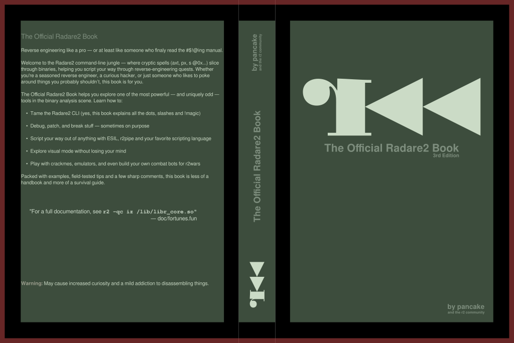

# Print on demand Radare2 Book Cover

This repository contains a cover design for the Radare2 book.

## Cover Details

- **File:** `r2_book_cover.pdf`
- **Book Format:** A5
- **Spine Width:** 21mm  
  (Designed for 414 pages using 80g paper)

## Customization Guidelines

If you are using a different paper weight or page count:
- You **must adjust the `cover_spine` layer** in the r2_book_cover.svg  file to reflect the new spine width.

If you are using a different book format or want to make graphical changes:
- Be sure to **maintain the bleed margin**.
- **Do not print across the full visible area**; some space must remain outside the printable region to account for trimming.

## Page Layout Guide

- The **red area** (in the `page_layout` layer) indicates the **bleed margin**.
- The **green area** shows the **printable region**.
- Before exporting the final PDF, make sure to **hide the `page_layout` layer**.

---

Always verify your final dimensions with your print provider before printing.

