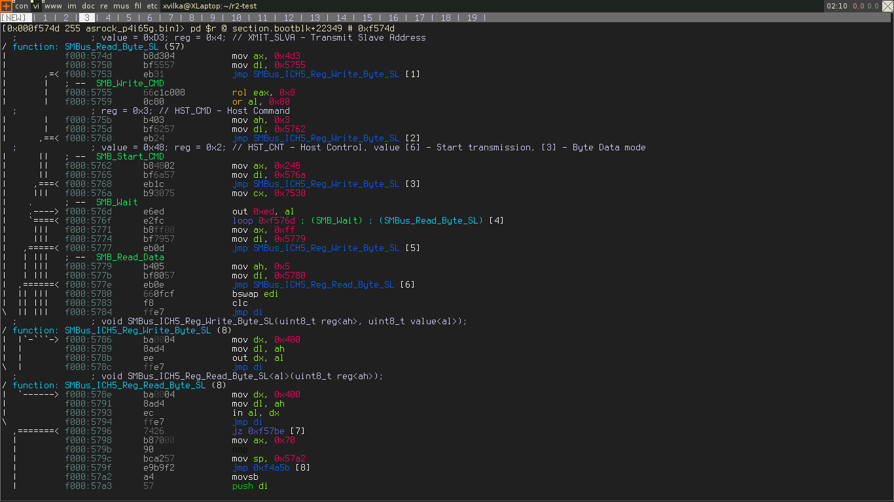

## Colors

Console access is wrapped in API that permits to show output of any command as ANSI, w32 console or HTML formats (more to come: ncurses, Pango etc.) This allows radare's core to run inside environments with limited displaying capabilities, like kernels or embedded devices. It is still possible to receive data from it in your favorite format.
To enable colors support by default, add a corresponding configuration option to the .radare2 configuration file:

    $ echo 'e scr.color=true' >> ~/.radare2rc

It is possible to configure color of almost any element of disassembly output. For *NIX terminals, r2 accepts color specification in RGB format. To change the console color palette use `ec` command. 
Type `ec` to get a list of all currently used colors. Type `ecs` to show a color palette to pick colors from:

#### xvilka theme

    ec fname rgb:0cf
    ec label rgb:0f3
    ec math rgb:660
    ec bin rgb:f90
    ec call rgb:f00
    ec jmp rgb:03f
    ec cjmp rgb:33c
    ec offset rgb:366
    ec comment rgb:0cf
    ec push rgb:0c0
    ec pop rgb:0c0
    ec cmp rgb:060
    ec nop rgb:000
    ec b0x00 rgb:444
    ec b0x7f rgb:555
    ec b0xff rgb:666
    ec btext rgb:777
    ec other rgb:bbb
    ec num rgb:f03
    ec reg rgb:6f0
    ec fline rgb:fc0
    ec flow rgb:0f0

