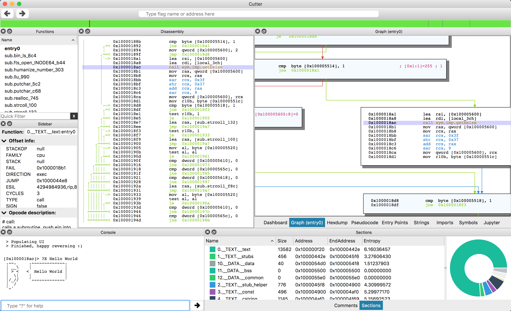

# User Interfaces

Radare2 has seen many different user interfaces being developed over the years.

But, as long as maintaining a GUI, is far from the scope of developing the core machinery of a reverse engineering toolkit it is better to have a separate project and community to allow both projects to collaborate and improve together rather than forcing cli developers to think in gui problems and having to jump back and forth between the graphic aspect and the low level logic of the implementations.

In the past, there have been at least 5 different native user interfaces (ragui, r2gui, gradare, r2net, bokken) but none of them got enough maintenance power to take off and they all died.

In addition, r2 have an embedded webserver and ships some basic user interfaces written in html/js. You can start them like this:

```
$ r2 -c=H /bin/ls
```

After 3 years of private development, Hugo Teso; the author of Bokken (python-gtk gui of r2) released to the public another frontend of r2, this time written in c++ and qt, which has been very welcomed by the community.

This GUI was named Iaito, but as long as he prefered not to keep maintaining it, Xarkes decided to fork it under the name of Cutter (name voted by the community) and lead the project. That's how it looks:

* [https://github.com/radareorg/cutter](https://github.com/radareorg/cutter).


