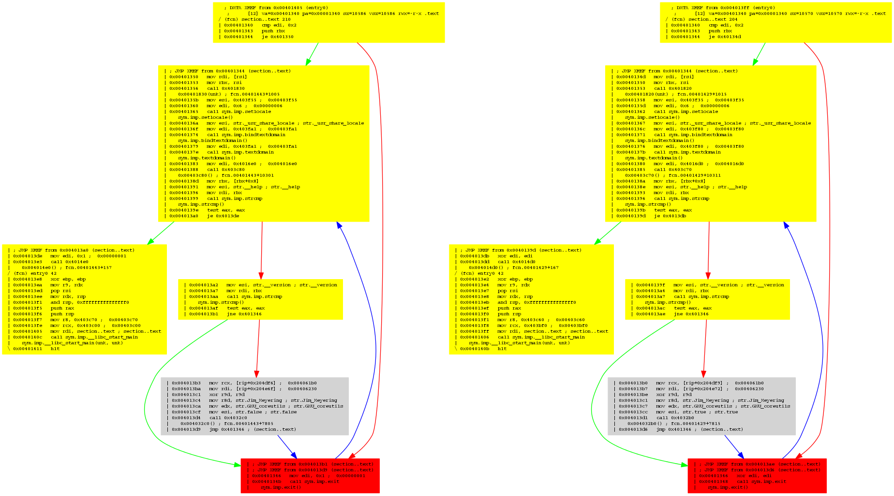

# Binary Diffing

This section is based on the http://radare.today article "[binary diffing](http://radare.today/binary-diffing/)"

Without any parameters, `radiff2` by default shows what bytes are changed and their corresponding offsets:
```
$ radiff2 genuine cracked
0x000081e0 85c00f94c0 => 9090909090 0x000081e0
0x0007c805 85c00f84c0 => 9090909090 0x0007c805

$ rasm2 -d 85c00f94c0
test eax, eax
sete al
```
Notice how the two jumps are nop'ed.

For bulk processing, you may want to have a higher-level overview of differences. This is why radare2 is able to compute the distance and the percentage of similarity between two files with the `-s` option:
```
$ radiff2 -s /bin/true /bin/false
similarity: 0.97
distance: 743
```

If you want more concrete data, it's also possible to count the differences, with the `-c` option:
```
$ radiff2 -c genuine cracked
2
```

If you are unsure whether you are dealing with similar binaries, with `-C` flag you can check there are matching functions. It this mode, it will give you three columns for all functions: "First file offset", "Percentage of matching" and "Second file offset".

```
$ radiff2 -C /bin/false /bin/true
  entry0  0x4013e8 |   MATCH  (0.904762) | 0x4013e2  entry0
  sym.imp.__libc_start_main  0x401190 |   MATCH  (1.000000) | 0x401190  sym.imp.__libc_start_main
  fcn.00401196  0x401196 |   MATCH  (1.000000) | 0x401196  fcn.00401196
  fcn.0040103c  0x40103c |   MATCH  (1.000000) | 0x40103c  fcn.0040103c
  fcn.00401046  0x401046 |   MATCH  (1.000000) | 0x401046  fcn.00401046
  fcn.000045e0   24 0x45e0 | UNMATCH  (0.916667) | 0x45f0    24 fcn.000045f0
  ...
```
Moreover, we can ask radiff2 to perform analysis first - adding `-A` option will run `aaa` on the binaries.
And we can specify binaries architecture for this analysis too using
```
$ radiff2 -AC -a x86 /bin/true /bin/false | grep UNMATCH
[x] Analyze all flags starting with sym. and entry0 (aa)
[x] Analyze len bytes of instructions for references (aar)
[x] Analyze function calls (aac)
[ ] [*] Use -AA or aaaa to perform additional experimental analysis.
[x] Constructing a function name for fcn.* and sym.func.* functions (aan))
[x] Analyze all flags starting with sym. and entry0 (aa)
[x] Analyze len bytes of instructions for references (aar)
[x] Analyze function calls (aac)
[ ] [*] Use -AA or aaaa to perform additional experimental analysis.
[x] Constructing a function name for fcn.* and sym.func.* functions (aan))
                        sub.fileno_500   86 0x4500 | UNMATCH  (0.965116) | 0x4510    86 sub.fileno_510
                    sub.__freading_4c0   59 0x44c0 | UNMATCH  (0.949153) | 0x44d0    59 sub.__freading_4d0
                        sub.fileno_440  120 0x4440 | UNMATCH  (0.200000) | 0x4450   120 sub.fileno_450
                     sub.setlocale_fa0   64 0x3fa0 | UNMATCH  (0.104651) | 0x3fb0    64 sub.setlocale_fb0
                          fcn.00003a50  120 0x3a50 | UNMATCH  (0.125000) | 0x3a60   120 fcn.00003a60
```

And now a cool feature : radare2 supports graph-diffing, à la [DarunGrim](http://www.darungrim.org/), with the `-g` option. You can either give it a symbol name, of specify two offsets, if the function you want to diff is named differently in compared files. For example, `radiff2 -g main /bin/true /bin/false | xdot -` will show differences in `main()` function of Unix `true` and `false` programs. You can compare it to `radiff2 -g main /bin/false /bin/true` (Notice the order of the arguments) to get the two versions.
This is the result:




Parts in yellow indicate that some offsets do not match. The grey piece means a perfect match. The red one highlights a strong difference. If you look closely, you will see that the left part of the picture has `mov edi, 0x1; call sym.imp.exit`, while the right one has `xor edi, edi; call sym.imp.exit`.

Binary diffing is an important feature for reverse engineering. It can be used to analyze [security updates](https://en.wikipedia.org/wiki/Patch_Tuesday), infected binaries, firmware changes and more...

We have only shown the code analysis diffing functionality, but radare2 supports additional types of diffing between two binaries: at byte level, deltified similarities, and more to come.

We have plans to implement more kinds of bindiffing algorithms into r2, and why not, add support for ASCII art graph diffing and better integration with the rest of the toolkit.

