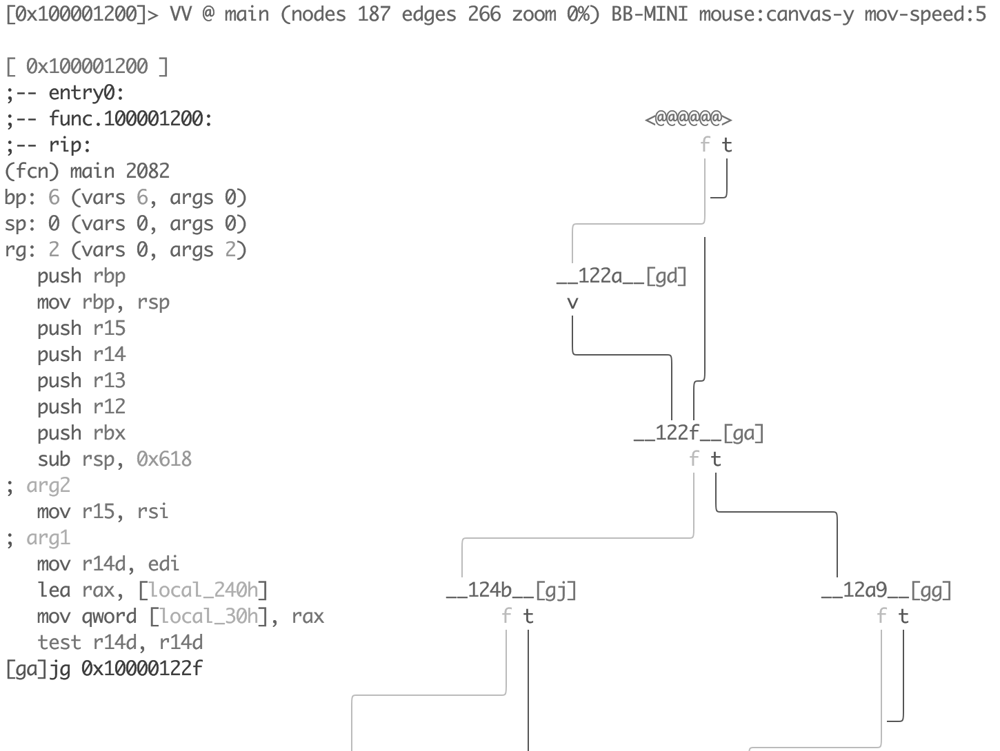

# Анализ кода

Анализ кода является распространенным методом, используемым для извлечения информации из ассемблерного кода. Radare2 включает различные методы анализа кода, реализованные в ядре и доступные в разных командах. Все функциональные возможности r2 доступны также при помощи API. API дает возможность реализовать новые этапы анализа, используя какой-либо язык программирования, и даже при помощи командной строки r2, скриптов в операционной системе, реализовать алгоритмы при помощи плагинов. Цель анализа — выявить внутренние структуры данных для идентификации *базовых блоков* (наборов инструкция процессора, ограниченных метками и адресными переходами), *вызовов функций* и извлечения *информации* на уровне *оп-кодов*.

Наиболее распространенной последовательностью команд анализа radare2 является `aa`, что расшифровывается как «*analyze all*». Это относится ко всем символам и точкам входа. Если в двоичном файле удалены (stripped) символы, нужно использовать другие команды, такие как `aaa`, `aab`, `aar`, `aac` и им подобные. Каждая команда выявляет свою информацию, и для эффективного их использования необходимо ознакомиться в ними и подобрать набор для решения конкретных задач.

```
[0x08048440]> aa
[0x08048440]> pdf @ main
		   ; DATA XREF from 0x08048457 (entry0)
/ (fcn) fcn.08048648 141
|     ;-- main:
|     0x08048648    8d4c2404     lea ecx, [esp+0x4]
|     0x0804864c    83e4f0       and esp, 0xfffffff0
|     0x0804864f    ff71fc       push dword [ecx-0x4]
|     0x08048652    55           push ebp
|     ; CODE (CALL) XREF from 0x08048734 (fcn.080486e5)
|     0x08048653    89e5         mov ebp, esp
|     0x08048655    83ec28       sub esp, 0x28
|     0x08048658    894df4       mov [ebp-0xc], ecx
|     0x0804865b    895df8       mov [ebp-0x8], ebx
|     0x0804865e    8975fc       mov [ebp-0x4], esi
|     0x08048661    8b19         mov ebx, [ecx]
|     0x08048663    8b7104       mov esi, [ecx+0x4]
|     0x08048666    c744240c000. mov dword [esp+0xc], 0x0
|     0x0804866e    c7442408010. mov dword [esp+0x8], 0x1 ;  0x00000001
|     0x08048676    c7442404000. mov dword [esp+0x4], 0x0
|     0x0804867e    c7042400000. mov dword [esp], 0x0
|     0x08048685    e852fdffff   call sym..imp.ptrace
|        sym..imp.ptrace(unk, unk)
|     0x0804868a    85c0         test eax, eax
| ,=< 0x0804868c    7911         jns 0x804869f
| |   0x0804868e    c70424cf870. mov dword [esp], str.Don_tuseadebuguer_ ;  0x080487cf
| |   0x08048695    e882fdffff   call sym..imp.puts
| |      sym..imp.puts()
| |   0x0804869a    e80dfdffff   call sym..imp.abort
| |      sym..imp.abort()
| `-> 0x0804869f    83fb02       cmp ebx, 0x2
|,==< 0x080486a2    7411         je 0x80486b5
||    0x080486a4    c704240c880. mov dword [esp], str.Youmustgiveapasswordforusethisprogram_ ;  0x0804880c
||    0x080486ab    e86cfdffff   call sym..imp.puts
||       sym..imp.puts()
||    0x080486b0    e8f7fcffff   call sym..imp.abort
||       sym..imp.abort()
|`--> 0x080486b5    8b4604       mov eax, [esi+0x4]
|     0x080486b8    890424       mov [esp], eax
|     0x080486bb    e8e5feffff   call fcn.080485a5
|        fcn.080485a5() ; fcn.080484c6+223
|     0x080486c0    b800000000   mov eax, 0x0
|     0x080486c5    8b4df4       mov ecx, [ebp-0xc]
|     0x080486c8    8b5df8       mov ebx, [ebp-0x8]
|     0x080486cb    8b75fc       mov esi, [ebp-0x4]
|     0x080486ce    89ec         mov esp, ebp
|     0x080486d0    5d           pop ebp
|     0x080486d1    8d61fc       lea esp, [ecx-0x4]
\     0x080486d4    c3           ret
```

В этом примере анализируется весь файл (`aa`), а затем печатается дизассемблирование функции `main()` (`pdf`). Команда `aa` относится к семейству команд автоматического анализа и выполняет только самые основные этапы автоматического анализа. В radare2 существует множество различных типов команд автоматического анализа с
различной "глубиной" анализа, включая частичную эмуляцию: `aa`, `aaa`, `aab`, `aaaa`, ... Существует также аналоги этих команд в виде флагов командной строки r2: `r2 -A`, `r2 -AA` и так далее.

Полностью автоматизированный анализ может дать противоречивые результаты. Ранее было сказано, что radare2 предоставляет отдельные команды для конкретных этапов анализа, что позволяет контролировать процесс выявления информации об алгоритме и структурах данных. Существует большой набор конфигурационных переменных для управления результатами анализа. Их можно найти в пространстве имен `anal.*` и `emu.*`.

## Анализ функций

Одной из наиболее важных «базовых» команд анализа является набор команд `af`.  Комбинация`af` означает "*анализ функций*" (analyze function). Команда запускает автоматический анализ заданной функции. При желании описать функцию можно и вручную.

```
[0x00000000]> af?
Usage: af
| af ([name]) ([addr])                  анализ функций, начиная с заданного смещения или с $$
| afr ([name]) ([addr])                 анализировать функции рекурсивно
| af+ addr name [type] [diff]           ручной анализ функции (требует afb+)
| af- [addr]                            стереть все данные анализа функции (можно задавать смещением)
| afa                                   анализировать аргументы функции в точке вызова (afal управляется переменной dbg.funcarg)
| afb+ fcnA bbA sz [j] [f] ([t]( [d]))  добавить bb к функции @ fcnaddr
| afb[?] [addr]                         перечислить базовые блоки заданной функции
| afbF([0|1])                           скрыть/раскрыть базовый блок (переключить атрибут 'folded')
| afB 16                                сделать текущую функцию как "основную" (thumb) (настраивается переменной asm.bits)
| afC[lc] ([addr])@[addr]               вычислить Cycles (afC) или Cyclomatic Complexity (afCc)
| afc[?] type @[addr]                   установить соглашение о вызове для функции
| afd[addr]                             показать функцию + адрес для заданного смещения
| afF[1|0|]                             скрыть/раскрыть/переключить
| afi [addr|fcn.name]                   показать информацию о функциях (более подробный afl)
| afj [tableaddr] [count]               анализировать таблицу переходов функции
| afl[?] [ls*] [fcn name]               перечислить функции (смещение, размер, bbs, имя) (смотрите afll)
| afm name                              объединить две функции
| afM name                              вывести карту функций
| afn[?] name [addr]                    переименования функции по заданному адресу (поменять и флаг)
| afna                                  предложить имя функции автоматически для текущего смещения
| afo[?j] [fcn.name]                    показать адрес функции по ее адресу или текущему смещению
| afs[!] ([fcnsign])                    показать/установить сигнатуру функции по текущему смещению (afs! использует cfg.editor)
| afS[stack_size]                       установить размер фрейма стека для функции по текущему смещению
| afsr [function_name] [new_type]       изменить тит для заданной функции
| aft[?]                                сопоставление и распространение (propagation) типов
| afu addr                              изменть размер текущей функции в соответствии с заданным конечным смещением, затем провести ее анализ
| afv[absrx]?                           изменить данные об аргументах, регистрах и переменных функции
| afx                                   перечислить ссылки на функцию
```
Используйте `afl` для перечисления найденных в результате анализа функций. В группе `afl` есть еще много полезных команд, таких как `aflj`, которая выводит данные о функции в формате JSON, `aflm`, представляющая функции в виде, аналогичном makefile. Есть также `afl=`, отображающая ASCII-арт-схему памяти функции. Остальные команды можно найти, набрав `afl?`.

Некоторые из наиболее сложных задач при выполнении анализа функций — это слияние, обрезка и изменение ее размера. Как и в случае с другими командами анализа, есть два режима: полуавтоматический и ручной. В полуавтоматическом режиме можно использовать `afm <function name>` для объединения текущей функции с другой, указанной именем в аргументе команды,  `aff` проведет повторный анализ функции после сделанных изменений или ее редактирования, `afu <address>` — изменение размера функции, задаваемого конечным смещением, и повторный ее анализ.

Помимо перечисленных выше полуавтоматических способов редактирования / анализа функции,  анализ можно проводить в ручном режиме с помощью команды `af+`, редактировать базовые блоки при помощи команд `afb`. Перед изменением базовых блоков функции рекомендуется сначала ознакомиться с уже имеющимися:

```
[0x00003ac0]> afb
0x00003ac0 0x00003b7f 01:001A 191 f 0x00003b7f
0x00003b7f 0x00003b84 00:0000 5 j 0x00003b92 f 0x00003b84
0x00003b84 0x00003b8d 00:0000 9 f 0x00003b8d
0x00003b8d 0x00003b92 00:0000 5
0x00003b92 0x00003ba8 01:0030 22 j 0x00003ba8
0x00003ba8 0x00003bf9 00:0000 81
```

### Анализ функции вручную

Давайте сначала создадим двоичный файл, например:

```C
int code_block()
{
  int result = 0;

  for(int i = 0; i < 10; ++i)
    result += 1;

  return result;
}
```
Затем скомпилируем его `gcc -c example.c -m32 -O0 -fno-pie`, получим объектный файл `example.o`, откройте его с помощью radare2. Поскольку он еще не проанализирован, команда `pdf` не покажет дизассемблирование:
```
$ r2 example.o
[0x08000034]> pdf
p: Cannot find function at 0x08000034
[0x08000034]> pd
            ;-- section..text:
            ;-- .text:
            ;-- code_block:
            ;-- eip:
            0x08000034      55             push ebp                    ; [01] -r-x section size 41 named .text
            0x08000035      89e5           mov ebp, esp
            0x08000037      83ec10         sub esp, 0x10
            0x0800003a      c745f8000000.  mov dword [ebp - 8], 0
            0x08000041      c745fc000000.  mov dword [ebp - 4], 0
        ,=< 0x08000048      eb08           jmp 0x8000052
       .--> 0x0800004a      8345f801       add dword [ebp - 8], 1
       :|   0x0800004e      8345fc01       add dword [ebp - 4], 1
       :`-> 0x08000052      837dfc09       cmp dword [ebp - 4], 9
       `==< 0x08000056      7ef2           jle 0x800004a
            0x08000058      8b45f8         mov eax, dword [ebp - 8]
            0x0800005b      c9             leave
            0x0800005c      c3             ret

```
Наша цель состоит в том, чтобы вручную создать функцию со следующей структурой


Создаем функцию по смещению 0x8000034 с именем code_block:
```
[0x8000034]> af+ 0x8000034 code_block
```

В большинстве случаев инструкции jump или call используется в качестве границ блоков кода.

Таким образом, диапазон первого блока составляет от `0x08000034 push ebp` до `0x08000048 jmp 0x8000052`, используем команду `afb+` для его задания (добавления).

```
[0x08000034]> afb+ code_block 0x8000034 0x800004a-0x8000034 0x8000052
```

Обратите внимание, что базовым синтаксисом `afb+` является `afb+ function_address block_address block_size [jump] [fail]`. Последняя инструкция этого блока содержит новый адрес (jmp 0x8000052), поэтому добавляем этот адрес перехода (0x8000052) в аргументы команды, чтобы явным образом *отразить информацию о переходе*.

Следующий блок (0x08000052 ~ 0x08000056) является скорее условным оператором if, который включает две ветви. Переход (аргумент `jump`) на 0x800004a произойдет, если выполнится `jle` (меньше или равно), в противном случае (аргумент `fail`) произойдет переход к следующей инструкции по адресу 0x08000058:

```
[0x08000034]> afb+ code_block 0x8000052 0x8000058-0x8000052 0x800004a 0x8000058
```

Следуя потоку управления, создаем оставшиеся два блока (для вышеупомянутых ветвей):
```
[0x08000034]> afb+ code_block 0x800004a 0x8000052-0x800004a 0x8000052
[0x08000034]> afb+ code_block 0x8000058 0x800005d-0x8000058
```

В результате получим:
```
[0x08000034]> afb
0x08000034 0x0800004a 00:0000 22 j 0x08000052
0x0800004a 0x08000052 00:0000 8 j 0x08000052
0x08000052 0x08000058 00:0000 6 j 0x0800004a f 0x08000058
0x08000058 0x0800005d 00:0000 5
[0x08000034]> VV
```


[Для этого] есть две очень важные команды: `afc` и `afB`. Последняя является обязательной командой для некоторых платформ, таких как ARM. Она предоставляет способ изменения "bitness" конкретной функции, позволяя выбирать между режимами ARM и Thumb. Команда `afc` позволяет вручную указать соглашение о вызове функции. Более подробную информацию о ее использовании смотрите в [calling_conventions](calling_conventions.md).

## Рекурсивный анализ

Существует пять важных команд полуавтоматического анализа всей программы:

- `aab` - выполнение анализа базовых блоков (алгоритм "Nucleus"),
- `aac` - анализ вызовов функций из заданной или текущей функции,
- `aaf` - анализ всех вызовов функций,
- `aar` - анализ ссылок на данные,
- `aad` - анализ указателей на адреса.

И это только общие полуавтоматические алгоритмы поиска ссылок. Radare2 обеспечивает широкий выбор инструментов ручного задания ссылок. Детальное управление информационной разметкой функции - использование команды `ax`.

```
Usage: ax[?d-l*]   # смотрите также 'afx?'
| ax              перечислить ссылки
| ax*             вывести команды radare
| ax addr [at]    добавить ссывку на код, ссылающийся на addr (из текущего смещения)
| ax- [at]        очистить все ссылки и ссылки с адреса
| ax-*            очистить все ссылки
| axc addr [at]   добавить ссыдку на код общего вида
| axC addr [at]   добавить ссылку на вызываемый код
| axg [addr]      показать граф xrefs достижения текущей функции
| axg* [addr]     показать граф xrefs достижения заданного адреса, используйте .axg*;aggv
| axgj [addr]     показать граф xrefs достижения текущей функции в формате json
| axd addr [at]   добавить ссфлку на данные
| axq             перечислить ссылки в простом удобном для человека формате
| axj             перечислить ссылки в формате json
| axF [flg-glob]  найти ссылки на данные или код флагов
| axm addr [at]   копировать ссылки на данные/код, ссылающиеся на адрес и, возможно, на текущее смещение (аргумент at)
| axt [addr]      найти ссылки на данные или код на заданный адрес
| axf [addr]      найти ссылки на данные или код с заданного адреса
| axv [addr]      перечислить сылки чтения, изменения, запуска на локальные переменные
| ax. [addr]      найти ссылки на данные или код из и с заданного адреса
| axff[j] [addr]  найти ссылки на данные или код из заданной функции
| axs addr [at]   добавить ссылку на строку
```

Наиболее часто используемыми командами группы `ax` являются `axt` и `axf`, особенно в составе различных сценариев r2pipe.  Допустим, мы видим строку в разделе данных или кода и хотим найти все места
ссылок на нее, используем `axt`:

```
[0x0001783a]> pd 2
;-- str.02x:
; STRING XREF from 0x00005de0 (sub.strlen_d50)
; CODE XREF from 0x00017838 (str.._s_s_s + 7)
0x0001783a     .string "%%%02x" ; len=7
;-- str.src_ls.c:
; STRING XREF from 0x0000541b (sub.free_b04)
; STRING XREF from 0x0000543a (sub.__assert_fail_41f + 27)
; STRING XREF from 0x00005459 (sub.__assert_fail_41f + 58)
; STRING XREF from 0x00005f9e (sub._setjmp_e30)
; CODE XREF from 0x0001783f (str.02x + 5)
0x00017841 .string "src/ls.c" ; len=9
[0x0001783a]> axt
sub.strlen_d50 0x5de0 [STRING] lea rcx, str.02x
(nofunc) 0x17838 [CODE] jae str.02x
```

Есть также несколько полезных команд в подгруппе `axt`. Команда `axtg` - выполнения перечня команд radare2, анализирующих программные объекты, ссылающиеся на функцию, используя информацию в XREF).

```
[0x08048320]> s main
[0x080483e0]> axtg
agn 0x8048337 "entry0 + 23"
agn 0x80483e0 "main"
age 0x8048337 0x80483e0
```

Используйте `axt*` для просмотра команд radare2 и установки флагов на соответствующие адреса в XREF. Также в группе `ax` находится `axg`, которая находит путь между двумя точками в файле, показывая граф XREF для достижения смещения или функции, например:

```
:> axg sym.imp.printf
- 0x08048a5c fcn 0x08048a5c sym.imp.printf
  - 0x080483e5 fcn 0x080483e0 main
  - 0x080483e0 fcn 0x080483e0 main
    - 0x08048337 fcn 0x08048320 entry0
  - 0x08048425 fcn 0x080483e0 main
```
Используйте `axg*` для генерации команд radare2, которые помогут вам создавать графики с использованием команд `agn` и `age` в соответствии с XREF. Помимо предопределенных алгоритмов для идентификации функций есть способ указать "*прелюдию*" (prelude) функции с параметром конфигурации `anal.prelude`. Например, `e anal.prelude = 0x554889e5` задает прелюдию на платформе x86\_64:

```
push rbp
mov rbp, rsp
```

Она должна быть задана _перед_ тем, как запускать команды анализа.

## Конфигурация

Radare2 позволяет изменять поведение практически любых этапов анализа и поведение команд. Существуют различные типы параметров конфигурации:

- Управление потоком,
- Управление основными блоками,
- Элемент управления ссылками,
- Ввод-вывод, диапазоны,
- Управление анализом таблиц переходов,
- Конкретные параметры платформы/процессора.

### Конфигурация потока управления

Двумя наиболее часто используемыми вариантами изменения поведения анализа потока управления в radare2 являются: `anal.hasext` и `anal.jmp.after`. Первая настройка заставляет radare2 продолжить анализ после окончания функции, даже если следующий кусок кода не вызывается откуда-либо, — это анализ всех доступных функций. Вторая настройка заставляет radare2 продолжать анализ после безусловных переходов, найденных в коде тела функции.

В дополнение к ним `anal.jmp.indir` управляет отслеживанием косвенных переходов; `anal.pushret` - анализа последовательностей `push ...; ret`; `anal.nopskip` для пропуска NOP-последовательности в начале функции.

На данный момент radare2 также позволяет изменять максимальный размер базового блока при помощи переменной `anal.bb.maxsize`. Значение по умолчанию подходит к большинству случаев использования, полезно увеличивать его при работе с обфусцированным кодом, кодом в который внесены незначащие инструкции, но значительно усложняющие анализ кода тела функции. Некоторые из настроек управления базовыми блоками  могут быть изменены в будущем в пользу более автоматизированных способов их оценки.

Для некоторых необычных двоичных файлов или архитектур есть опция `anal.noncode`. По умолчанию Radare2 не пытается анализировать разделы данных в виде кода. Но в некоторых случаях – вредоносное ПО, упакованные двоичные файлы, двоичные файлы для встраиваемых систем — требуют проводить такой анализ.

### Управление ссылками

Управление ссылками — наиболее важные настройки, кардинально меняющие результаты анализа. Некоторые настройки можно отключить для экономии времени и памяти при анализе больших двоичных файлов.

- `anal.jmp.ref` - разрешить создание ссылок на безусловные переходы,
- `anal.jmp.cref` - то же самое, но для условных переходов,
- `anal.datarefs` - отслеживание ссылок на данные в коде,
- `anal.refstr` - поиск строк в ссылках на данные,
- `anal.strings` - поиск строк и создание ссылок.

Флаг управления ссылками на строки по умолчанию отключен, так как увеличивает время анализа.

### Диапазоны анализа

Настройки:

- `anal.limits` позволяет использовать пределы диапазона для операций анализа,
- `anal.from` - начальный адрес предельного диапазона,
- `anal.to` - соответствующий конец предельного диапазона.
- `anal.in` - границы поиска для анализа. Вы можете установить его на `io.maps`, `io.sections.exec`, `dbg.maps` и др. Например:
   - Чтобы проанализировать конкретную карту памяти с помощью `anal.from` и `anal.to`, установите `anal.in = dbg.maps`.
   - Для анализа в заданных границах, установите `anal.from` и `anal.to`, затем установите `anal.in=range`.
   - Для анализа в текущем отображаемом сегменте или разделе можно установить `anal.in=bin.segment` или `anal.in=bin.section` соответственно.
   - Для анализа в текущей карте памяти укажите `anal.in=dbg.map`.
   - Для анализа в стеке или куче - задать `anal.in=dbg.stack` или `anal.in=dbg.heap`.
   - Для анализа в текущей функции или базовом блоке можно указать `anal.in=anal.fcn` или `anal.in=anal.bb`.

Полный список настроек доступен при помощи `e anal.in=??`.

### Таблицы переходов

Таблицы переходов являются одной из самых сложных целей в двоичном реверс-инжениринге. Их есть сотни различных типов, конечный результат зависит от компилятора/компоновщика и этапов оптимизации LTO. Radare2 позволяет включать некоторые экспериментальные алгоритмы обнаружения таблиц переходов с использованием `anal.jmp.tbl`. Наиболее сложные этапы анализа используют алгоритмы анализа адресов, упакованных в таблицы переходов. Этапы можно включить в перечень процедур, запускаемых по умолчанию для каждой поддерживаемой платформы. Есть еще две настройки, влияющие на результаты анализа таблиц переходов:

- `anal.jmp.indir` - отслеживать непрямые переходы, некоторые таблицы переходов опираются на них,
- `anal.datarefs` - отслеживать ссылки на данные, некоторые таблицы переходов используют их.

### Элементы управления, специфичные для платформы

Существует две распространенные проблемы при анализе встроенных архитектур: обнаружение ARM/Thumb и значения MIPS GP. В случае двоичных файлов ARM radare2 поддерживает автоматическое обнаружение переключателей режима ARM/Thumb, но надо иметь в виду, что он использует частичную эмуляцию ESIL, тем самым замедляя процесс анализа. Если результаты вас не устраивают, определенные параметры функций могут быть переопределены при помощи `afB`.

Проблема MIPS GP еще сложнее. Известно, что значение GP может быть разным не только для всей программы, но также и для отдельных функций. Частично проблему решают настройки `anal.gp` и `anal.gpfixed`. Первый устанавливает значение GP для всей программы или конкретной функции. Второй позволяет «фиксировать» значение GP, если какой-то код захочет изменить его, всегда сбрасывая его, если факт смены обнаружен. Они в значительной степени экспериментальны и могут быть изменены в будущем в пользу более автоматизированного анализа.

## Визуальный подход

Один из самых простых способов увидеть и проверить последствия изменений поведения команд анализа заключается в выполнении прокрутки в специальном визуальном режиме `Vv`, позволяющем выполнять функции предварительного просмотра:


Когда надо проверить, как изменения анализа влияют на результат в случае больших функций, вместо этого можно использовать мини-карту, позволяющую видеть общий граф управления на том же экране. Чтобы войти в режим мини-карты введите `VV`, затем дважды нажмите клавишу `p`:



Этот режим позволяет увидеть дизассемблирование каждого базового блока в отдельности, просто перемещаясь между ними с помощью клавиши `Tab`.

## Подсказки по анализу

Нередки случаи, когда результаты анализа не идеальны даже после того, как вы попробовали все до единого, включая параметры конфигурации. Именно здесь появляется механизм «analysis hints» radare2. Он позволяет переопределить некоторые основные свойства оп-кодов или метаданных или даже переписать всю строку оп-кода. Эти команды расположены в пространстве имен `ah`:

```
Usage: ah[lba-]  Подсказки (hints), генерируемые в результате анализа
| ah?                показать данную подсказку
| ah? offset         показать подсказки для заданного смещения
| ah                 перечислить подсказки в виде, удобном для чтения
| ah.                перечислить подсказки в виде, удобном для чтения, начиная с текущего смещения
| ah-                удалить все подсказки
| ah- offset [size]  удалить все подсказки, начиная с заденного смещения
| ah* offset         перечислить подсказки в формате команд radare
| aha ppc @ 0x42     задать архитекутуру ppc для всех адресов >= 0x42 или до следующей подсказки
| aha 0 @ 0x84       удалить вывод подсказок, касающихся архитектуры, для всех адресов >= 0x84 или до следующей подсказки
| ahb 16 @ 0x42      задать 16bit для всех адресов >= 0x42 или до следующей подсказки
| ahb 0 @ 0x84       отключить отображение подсказок класса "bits" для всех адресов >= 0x84 или до следующей подсказки
| ahc 0x804804       переназначить адрес call или jump
| ahd foo a0,33      заменить мнемонику оп-кода
| ahe 3,eax,+=       задать строковое отображение анализа виртуальной машины
| ahf 0x804840       переназначить fallback-адрес для call
| ahF 0x10           установить размер фрейма стека по текущему смещению
| ahh 0x804840       выделить визуально данный адрес в дизассемблировании
| ahi[?] 10          задать систему счисления для immediates (2, 8, 10, 10u, 16, i, p, S, s)
| ahj                перечислить подсказки в формате JSON
| aho call           сменить тип оп-кода (смотрите aho?) (устарело, перенесено в "ahd")
| ahp addr           установить подсказку для указателя
| ahr val            установить подсказку для возвращаемого значения функции
| ahs 4              установить размер оп-кода равным 4
| ahS jz             задать asm.syntax=jz для данного оп-кода
| aht [?] <type>     пометить immediate как смещение типа (устарело, перенесено в "aho")
| ahv val            сменить поле val оп-кода (полезно при назначении размеров таблиц переходов в jmp rax)
```

Один из наиболее распространенных случаев — установка системы счисления для чисел:

```
[0x00003d54]> ahi?
Usage: ahi [2|8|10|10u|16|bodhipSs] [@ offset]   Задание системы счисления
| ahi <base>  задать систему счисления (2, 8, 10, 16)
| ahi 10|d    задать десятичную систему счисления со знаком (10), бит знака зависит от размера операнда
| ahi 10u|du  задать десятичную систему счисления без знака (11)
| ahi b       задать двоичную систему счисления (2)
| ahi o       задать восмеричную систему счисления (8)
| ahi h       задать шестнадцатеричную систему счисления (16)
| ahi i       представлять как IP-адрес (32)
| ahi p       представлять как htons(port) (3)
| ahi S       представлять как syscall (80)
| ahi s       представлять в виде строки (1)

[0x00003d54]> pd 2
0x00003d54      0583000000     add eax, 0x83
0x00003d59      3d13010000     cmp eax, 0x113
[0x00003d54]> ahi d
[0x00003d54]> pd 2
0x00003d54      0583000000     add eax, 131
0x00003d59      3d13010000     cmp eax, 0x113
[0x00003d54]> ahi b
[0x00003d54]> pd 2
0x00003d54      0583000000     add eax, 10000011b
0x00003d59      3d13010000     cmp eax, 0x113
```

Примечательно, что некоторые этапы анализа или команды добавляют подсказки внутреннего анализа, которые можно проверить с помощью команды `ah` :

```
[0x00003d54]> ah
 0x00003d54 - 0x00003d54 => immbase=2
[0x00003d54]> ah*
 ahi 2 @ 0x3d54
```

Иногда нам нужно переопределить адрес перехода или вызова, например, в случае замысловатого перемещения, неизвестного radare2. Текущую аналитическую информацию о конкретном оп-коде можно проверить с помощью команды `ao`. Используем команду `ahc` для выполнения такого изменения:

```
[0x00003cee]> pd 2
0x00003cee      e83d080100     call sub.__errno_location_530
0x00003cf3      85c0           test eax, eax
[0x00003cee]> ao
address: 0x3cee
opcode: call 0x14530
mnemonic: call
prefix: 0
id: 56
bytes: e83d080100
refptr: 0
size: 5
sign: false
type: call
cycles: 3
esil: 83248,rip,8,rsp,-=,rsp,=[],rip,=
jump: 0x00014530
direction: exec
fail: 0x00003cf3
stack: null
family: cpu
stackop: null
[0x00003cee]> ahc 0x5382
[0x00003cee]> pd 2
0x00003cee      e83d080100     call sub.__errno_location_530
0x00003cf3      85c0           test eax, eax
[0x00003cee]> ao
address: 0x3cee
opcode: call 0x14530
mnemonic: call
prefix: 0
id: 56
bytes: e83d080100
refptr: 0
size: 5
sign: false
type: call
cycles: 3
esil: 83248,rip,8,rsp,-=,rsp,=[],rip,=
jump: 0x00005382
direction: exec
fail: 0x00003cf3
stack: null
family: cpu
stackop: null
[0x00003cee]> ah
 0x00003cee - 0x00003cee => jump: 0x5382
```

Как видите, несмотря на неизменный вид дизассемблирования, адрес перехода в оп-коде был изменен (настройка `jump`).

Если что-то из ранее описанного не помогло, можно просто переопределить показанное дизассемблирование чем-либо, что вам нравиться:

```
[0x00003d54]> pd 2
0x00003d54      0583000000     add eax, 10000011b
0x00003d59      3d13010000     cmp eax, 0x113
[0x00003d54]> "ahd myopcode bla, foo"
[0x00003d54]> pd 2
0x00003d54                     myopcode bla, foo
0x00003d55      830000         add dword [rax], 0
```
