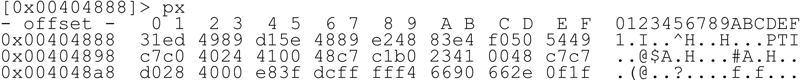

# Режимы отображения данных

Одной из ключевых особенностей radare2 является отображение информации, представляя ее в разных форматах. Цель состоит в том, чтобы предложить выбор вариантов отображения для наилучшей интерпретации двоичных данных. Двоичные данные представляют целые числа (int), shorts, longs, floats, timestamps, шестнадцатеричных строк или более сложных форматов, таких как структуры C, дизассемблированием, декомпиляцией, результатами внешних обработок и др.

Ниже приведен список доступных режимов отображения, перечисленных в `p?` (print):

```
[0x00005310]> p?
|Usage: p[=68abcdDfiImrstuxz] [arg|len] [@addr]
| p[b|B|xb] [len] ([S])   вывести двоичный дамп N-бит, пропустив S байт
| p[iI][df] [len]         вывести N оп-кодов/байт (f=func) (смотрите pi? и pdi)
| p[kK] [len]             распечатать ключ в виде random-art (K - использовать мозайку)
| p-[?][jh] [mode]        bar|json|гистограммные-блоки (режим: e?search.in)
| p2 [len]                представить плитками 8x8, 2bpp (2 бита на пиксель)
| p3 [file]               Напечатать стереограмму (3D)
| p6[de] [len]            кодирование/декодирование base64
| p8[?][j] [len]          список 8bit-овых шестнадцатеричных байтов
| p=[?][bep] [N] [L] [b]  построить диаграмму энтропии/печатных символов/символов
| pa[edD] [arg]           pa:ассоциирование pa[dD]:дизассемблирование или pae: ESIL-инструкции из шестнадцатеричных байтов
| pA[n_ops]               показать n_ops-адресс и тип
| pb[?] [n]               вывести в битовом представлении N бит
| pB[?] [n]               вывести в битовом представлении N байт
| pc[?][p] [len]          представить в формате C (или python)
| pC[aAcdDxw] [rows]      показать дизассемблирование в виде колонок (смотрите hex.cols и pdi)
| pd[?] [sz] [a] [b]      дизассемблировать N оп-кодов (pd) или N байт (pD)
| pf[?][.nam] [fmt]       распечатать отформатированные данные (pf.name, pf.name $<expr>)
| pF[?][apx]              распечатать asn1, pkcs7 или x509
| pg[?][x y w h] [cmd]    создать новый визуальный гаджет или распечатать его (смотри инструкцию в pg?)
| ph[?][=|hash] ([len])   вычислить хэш для блока
| pj[?] [len]             распечатать в виде JSON с отступами
| pm[?] [magic]           распечатать данные libmagic (смотрите pm? и /m?)
| po[?] hex               распечатать операцию, применяемую к блоку (смотрите po?)
| pp[?][sz] [len]         распечатать шаблоны, инструкция в pp?
| pq[?][is] [len]         распечатать QR-код для первых N байт
| pr[?][glx] [len]        распечатать N байт в raw-формате (в виде строк или шестнадцатеричных кодов, 'g'unzip)
| ps[?][pwz] [len]        распечатать строкии в форматах pascal/wide/zero-terminated
| pt[?][dn] [len]         распечатать различные timestamp-ы
| pu[?][w] [len]          распечатать N байт в кодировке url (w=wide)
| pv[?][jh] [mode]        показать переменную/указатель/значение в памяти
| pwd                     показать текущий рабочий директорий
| px[?][owq] [len]        вывести дамп N шестнадцатеричных байт (o=octal, w=32bit, q=64bit)
| pz[?] [len]             распечатать вид zoom (инструкция в pz?)
[0x00005310]>
```

Совет: при использовании вывода json можно добавлять `~{}` к команде, которая оформит красивые отступы:

```
[0x00000000]> oj
[{"raised":false,"fd":563280,"uri":"malloc://512","from":0,"writable":true,"size":512,"overlaps":false}]
[0x00000000]> oj~{}
[
	{
		"raised": false,
		"fd": 563280,
		"uri": "malloc://512",
		"from": 0,
		"writable": true,
		"size": 512,
		"overlaps": false
	}
]
```

Для получения дополнительной информации о функциональных возможностях `~` смотрите инструкцию в `?@?`, а также главу [Формат команды](../first_steps/command_format.md) в этой книге.

### Шестнадцатеричный вид

`px` дает удобный вывод, показывающий 16 пар чисел в строке со смещениями и raw-представлении:



#### Шестнадцатеричный дамп слов (32 бита)


#### 8-битовый шестнадцатеричный набор байтов

```
[0x00404888]> p8 16
31ed4989d15e4889e24883e4f0505449
```

#### Шестнадцатеричный дамп из Quad-слов (64 бита)


### Форматы даты/времени

В настоящее время поддерживаются следующие режимы вывода timestamp-ов:

```
[0x00404888]> pt?
|Usage: pt [dn]  print timestamps
| pt.  распечатать текущее время
| pt   распечатать время UNIX (32 бит `cfg.bigendian`) с 1 января 1970
| ptd  распечатать время DOS (32 бит `cfg.bigendian`) с 1 января 1980
| pth  распечатать время HFS (32 бит `cfg.bigendian`) с 1 января 1904
| ptn  распечатать время NTFS (64 бит `cfg.bigendian`) с с 1 января 1601
```

Например, можно представить текущий буфер в виде временных меток во времени NTFS:

```
[0x08048000]> e cfg.bigendian = false
[0x08048000]> pt 4
29:04:32948 23:12:36 +0000
[0x08048000]> e cfg.bigendian = true
[0x08048000]> pt 4
20:05:13001 09:29:21 +0000
```

Как видите, порядок байтов влияет на результат. После того, timestamp напечатан, можно профильтовать grep-ом выходные данные, например, по номеру года:

```
[0x08048000]> pt ~1974 | wc -l
15
[0x08048000]> pt ~2022
27:04:2022 16:15:43 +0000
```

Формат даты по умолчанию можно настроить с помощью переменной `cfg.datefmt`. Правила форматирования следуют хорошо известному формату strftime(3). Покажем справочную страницу, вот наиболее важное:

```
%a  Сокращенное название дня недели в соответствии с текущим языковым стандартом.
%A  Полное название дня недели в соответствии с текущим языковым стандартом.
%d  День месяца в виде десятичного числа (диапазон от 01 до 31).
%D  Эквивалентно %m/%d/%y.  (Yecch — только для американцев).
%H  Час в виде десятичного числа с использованием 24-часового формата (диапазон от 00 до 23).
%I  Час в виде десятичного числа с использованием 12-часового формата (диапазон от 01 до 12).
%m  Месяц в виде десятичного числа (диапазон от 01 до 12).
%M  Минута в виде десятичного числа (диапазон от 00 до 59).
%p  Либо "AM", либо "PM" в соответствии с заданным значением времени.
%s  Количество секунд со времен Эпохи, 1970-01-01 00:00:00 +0000 (UTC). (ТЗ)
%S  Секунда в виде десятичного числа (диапазон от 00 до 60).  (Диапазон составляет до 60 секунд, что позволяет время от времени использовать високосные секунды.)
%T  Время в 24-часовой нотации (%H:%M:%S).  (SU)
%y  Год в виде десятичного числа без века (диапазон от 00 до 99).
%Y  Год в виде десятичного числа, включая век.
%z  Числовой часовой пояс +hhmm или -hhmm (то есть часовое и минутное смещение от UTC). (SU)
%Z  Название или аббревиатура часового пояса.
```

### Основные типы

Существуют режимы печати, доступные для всех базовых типов. Если вас интересует более сложная структура, введите `pf??` для символов формата и `pf???` для примеров:

```
[0x00499999]> pf??
|pf: pf[.k[.f[=v]]|[v]]|[n]|[0|cnt][fmt] [a0 a1 ...]
| Format:
|  b       байт (unsigned)
|  B       интерпретировать битовое enum-поле (смотрите t?)
|  c       char (байт со знаком)
|  C       байт в десятичном виде
|  d       значение 0xHEX (4 байта) (смотрите 'i' и 'x')
|  D       дизассемблирование одного оп-кода
|  e       временно сменить порядок байтов
|  E       представить в виде имени из enum (смотрите t?)
|  f       значение float (4 байта)
|  F       значение double (8 байт)
|  i       целове значение со знаком (4 байта) (смотрите 'd' и 'x')
|  n       следующий символ задает размер значения со знаком (1, 2, 4 или 8 байт)
|  N       следующий символ задает размер значения без знака (1, 2, 4 или 8 байт)
|  o       восьмеричное значение (4 байта)
|  p       указатель (2, 4 или 8 байт)
|  q       quadword (8 байт)
|  r       регистр CPU `pf r (eax)plop`
|  s       32-битовый указатель на строку (4 байта)
|  S       64-битовый указатель на строку (8 байт)
|  t       UNIX timestamp (4 байта)
|  T       показать первых десять (Ten) байт буфера
|  u       uleb128 (variable length)
|  w       слово (2 байта, unsigned short в шестнадцатеричном виде)
|  x       значение в 0xHEX и флаг (fd @ addr) (смотрите 'd' и 'i')
|  X       отформатированный шестнадцатеричный дамп
|  z       строка, заканчивающаяся 0
|  Z       wide-строка, заканчивающаяся 0
|  ?       структура данных 'pf ? (имя_структуры)иня_экземпляра`
|  *       следующий символ - указатель (учитывает asm.bits)
|  +       включить/выключить вывод флага для каждого смещения
|  :       пропустить 4 байта
|  .       пропустить 1 байт
|  ;       отступить назад на 4 байтов
|  ,       отступить назад на 1 байт
```

Используйте тройной вопросительный знак `pf???` для просмотра примеров с использованием формата печати строк (printf).

```
[0x00499999]> pf???
|pf: pf[.k[.f[=v]]|[v]]|[n]|[0|cnt][fmt] [a0 a1 ...]
| Примеры:
| pf 3xi foo bar                               массив из трех структур, в каждой три поля: 'foo' в шестнадцатеричном виде и 'bar' в виде целого числа
| pf B (BitFldType)arg_name`                   тип битовых полей
| pf E (EnumType)arg_name`                     тип enum
| pf.obj xxdz prev next size name              определить формат obj как xxdz
| pf obj=xxdz prev next size name              то же, что и выше
| pf *z*i*w nb name blob                       распечатать указатели с заданными именами
| pf iwq foo bar troll                         распечатать в формате iwq, foo, bar, troll - соответствующие поля структуры
| pf 0iwq foo bar troll                        то же, что выше, но представляющих юнион (все поля на смещении 0)
| pf.plop ? (troll)mystruct                    использовать структуру troll, определенную ранее
| pfj.plop @ 0x14                              применить формат к заданному смещению
| pf 10xiz pointer length string               распечатать 10 ячеек массива структур формата xiz с соответствующими полями
| pf 5sqw string quad word                     распечатать массив элементов формата sqw с соответствующими полями
| pf {integer}? (bifc)                         распечатать integer раз формат (bifc)
| pf [4]w[7]i                                  распечатать массив из четырех слов и за ним массив из семи целых чисел
| pf ic...?i foo bar "(pf xw yo foo)troll" yo  распечатать вложенные непоименнованные структуры
| pf ;..x                                      распечатать значение, расположенное через шесть байт от текущего смещения
| pf [10]z[3]i[10]Zb                           распечатать строку фиксированного размера, widechar и переменную
| pfj +F @ 0x14                                распечатать содержимое по заданному смещению с флагом
| pf n2                                        распечатать знаковое короткое целое (2 байта) значение. Используйте N вместо n для печати беззнаковых значений
| pf [2]? (plop)structname @ 0                 Песатает массив структур
| pf eqew bigWord beef                         переключить порядок байтов, печать с использованием полей
| pf.foo rr (eax)reg1 (eip)reg2                создать объект ссылающийся на значение в регистре
| pf tt troll plop                             распечатать timestamp-ы, используя поля troll и plop
```
Ниже приведены примеры:
```
[0x4A13B8C0]> pf i
0x00404888 = 837634441
```
```
[0x4A13B8C0]> pf
0x00404888 = 837634432.000000
```

### Высокоуровневые представления в синтаксисе языков программирования

Допустимые форматы печати, использующие высокоуровневый синтаксис:

* `pc`     C
* `pc*`    печать команд 'wx' r2
* `pch`    C half-words (2 байта)
* `pcw`    слова C (4 байта)
* `pcd`    C dwords (8 байт)
* `pci`    массив байт C с инструкциями
* `pca`    GAS .byte blob
* `pcA`    .bytes с инструкциями в комментариях
* `pcs`    строка
* `pcS`    скрипт оболочки операционной системы, воссоздающий бинарные данные
* `pcj`    json
* `pcJ`    javascript
* `pco`    Objective-C
* `pcp`    python
* `pck`    kotlin
* `pcr`    rust
* `pcv`    JaVa
* `pcV`    V (vlang.io)
* `pcy`    yara
* `pcz`    Swift

Если нужно создать файл .c, содержащий BLOB, используйте команду `pc`. Размер по умолчанию такой же, как и в многих других командах: размер блока можно изменить с помощью команды `b`. Также можно просто временно переопределить этот размер блока, выразив его в качестве аргумента.

```
[0xB7F8E810]> pc 32
#define _BUFFER_SIZE 32
unsigned char buffer[_BUFFER_SIZE] = {
0x89, 0xe0, 0xe8, 0x49, 0x02, 0x00, 0x00, 0x89, 0xc7, 0xe8, 0xe2, 0xff, 0xff, 0xff, 0x81, 0xc3, 0xd6, 0xa7, 0x01, 0x00, 0x8b, 0x83, 0x00, 0xff, 0xff, 0xff, 0x5a, 0x8d, 0x24, 0x84, 0x29, 0xc2 };
```

Структура cstring может использоваться во многих языках программирования, а не только в C.

```
[0x7fcd6a891630]> pcs
"\x48\x89\xe7\xe8\x68\x39\x00\x00\x49\x89\xc4\x8b\x05\xef\x16\x22\x00\x5a\x48\x8d\x24\xc4\x29\xc2\x52\x48\x89\xd6\x49\x89\xe5\x48\x83\xe4\xf0\x48\x8b\x3d\x06\x1a
```

### Строки

С анализа строк, вероятно, начинается каждый реверс-инжениринг программы, поскольку на них обычно ссылается код тела функции: конкретные операторы, отладочная информация и другие сообщения. Поэтому radare поддерживает различные строковые форматы:

```
[0x00000000]> ps?
|Usage: ps[bijqpsuwWxz+] [N]  Печать строки
| ps       печать строки
| ps+[j]   печать строки libc++ std::string (same-endian, ascii, zero-terminated)
| psb      печать строк, найденных в текущем блоке
| psi      печать строки внутри ткущего смещения
| psj      печать строки в формате JSON
| psp[j]   печать pascal-строки
| psq      синоним для pqs
| pss      печать строки на экран, вставляя переносы
| psu[zj]  печать utf16-юникода (json)
| psw[j]   печать wide-строку 16-бит
| psW[j]   печать wide-строку 32-бит
| psx      показать строку при помощи escape-последовательностей
| psz[j]   печать строки, заканчивающихся нулем
```

Большинство строк заканчиваются нулем. Ниже приведен пример использования отладчика для продолжения выполнения программы до тех пор, пока не выполнится системный вызов 'open'. Как только контроль за процесом восстановлен, получаем аргументы, переданные в системный вызов, на которые указывает %ebx. В случае вызова 'open' это строка с нулевым окончанием, проверим с помощью `psz`.

```
[0x4A13B8C0]> dcs open
0x4a14fc24 syscall(5) open ( 0x4a151c91 0x00000000 0x00000000 ) = 0xffffffda
[0x4A13B8C0]> dr
  eax  0xffffffda    esi  0xffffffff    eip    0x4a14fc24
  ebx  0x4a151c91    edi  0x4a151be1    oeax   0x00000005
  ecx  0x00000000    esp  0xbfbedb1c    eflags 0x200246
  edx  0x00000000    ebp  0xbfbedbb0    cPaZstIdor0 (PZI)
[0x4A13B8C0]>
[0x4A13B8C0]> psz @ 0x4a151c91
/etc/ld.so.cache
```

### Печать содержимого памяти

Печать различных упакованных типов данных делается с помощью команды `pf`:

```
[0xB7F08810]> pf xxS @ rsp
0x7fff0d29da30 = 0x00000001
0x7fff0d29da34 = 0x00000000
0x7fff0d29da38 = 0x7fff0d29da38 -> 0x0d29f7ee /bin/ls
```

Форматы можно использовать для просмотра аргументов, передаваемых функции. Передайте строку, описывающую формат в  аргумент `pf` и задайте смещение при помощи `@`. Также можно определять массивы структур. Для этого добавьте к строке форматирования префикс с числовым значением. Можно также определять имена для каждого поля структуры, добавив их в виде списка аргументов, разделенных пробелами.

```
[0x4A13B8C0]> pf 2*xw pointer type @ esp
0x00404888 [0] {
   pointer :
(*0xffffffff8949ed31)      type : 0x00404888 = 0x8949ed31
   0x00404890 = 0x48e2
}
0x00404892 [1] {
(*0x50f0e483)    pointer : 0x00404892 = 0x50f0e483
	 type : 0x0040489a = 0x2440
}
```

Практический пример использования `pf` в двоичном файле плагина GStreamer:

```
$ radare2 /usr/lib/gstreamer-1.0/libgstflv.so
[0x00006020]> aa; pdf @ sym.gst_plugin_flv_get_desc
[x] Analyze all flags starting with sym. and entry0 (aa)
sym.gst_plugin_flv_get_desc ();
[...]
      0x00013830      488d0549db0000  lea rax, section..data.rel.ro ; 0x21380
      0x00013837      c3              ret
[0x00006020]> s section..data.rel.ro
[0x00021380]> pf ii*z*zp*z*z*z*z*z*z major minor name desc init version license source package origin release_datetime
            major : 0x00021380 = 1
            minor : 0x00021384 = 18
             name : (*0x19cf2)0x00021388 = "flv"
             desc : (*0x1b358)0x00021390 = "FLV muxing and demuxing plugin"
             init : 0x00021398 = (qword)0x0000000000013460
          version : (*0x19cae)0x000213a0 = "1.18.2"
          license : (*0x19ce1)0x000213a8 = "LGPL"
           source : (*0x19cd0)0x000213b0 = "gst-plugins-good"
          package : (*0x1b378)0x000213b8 = "GStreamer Good Plugins (Arch Linux)"
           origin : (*0x19cb5)0x000213c0 = "https://www.archlinux.org/"
 release_datetime : (*0x19cf6)0x000213c8 = "2020-12-06"
```

### Дизассемблирование

Команда `pd` используется для дизассемблирования кода. Она принимает числовое значение, указывающее, сколько инструкций должно быть разобрано. Команда `pD` аналогична, но вместо нескольких инструкций она декомпилирует заданное количество байтов.

* `d` : дизассемблирование N оп-кодов, количество оп-кодов,
* `D` : дизассемблировать N байт, учитывая asm.arch

```
[0x00404888]> pd 1
;-- entry0:
0x00404888    31ed         xor ebp, ebp
```

### Выбор целевой архитектуры

Целевая архитектура дизассемблера определяется переменной `asm.arch`. Можно использовать `e asm.arch=??` для перечисления всех доступных архитектур.

```
[0x00005310]> e asm.arch=??
_dAe  _8_16      6502        LGPL3   6502/NES/C64/Tamagotchi/T-1000 CPU
_dAe  _8         8051        PD      8051 Intel CPU
_dA_  _16_32     arc         GPL3    Argonaut RISC Core
a___  _16_32_64  arm.as      LGPL3   as ARM Assembler (use ARM_AS environment)
adAe  _16_32_64  arm         BSD     Capstone ARM disassembler
_dA_  _16_32_64  arm.gnu     GPL3    Acorn RISC Machine CPU
_d__  _16_32     arm.winedbg LGPL2   WineDBG's ARM disassembler
adAe  _8_16      avr         GPL     AVR Atmel
adAe  _16_32_64  bf          LGPL3   Brainfuck
_dA_  _32        chip8       LGPL3   Chip8 disassembler
_dA_  _16        cr16        LGPL3   cr16 disassembly plugin
_dA_  _32        cris        GPL3    Axis Communications 32-bit embedded processor
adA_  _32_64     dalvik      LGPL3   AndroidVM Dalvik
ad__  _16        dcpu16      PD      Mojang's DCPU-16
_dA_  _32_64     ebc         LGPL3   EFI Bytecode
adAe  _16        gb          LGPL3   GameBoy(TM) (z80-like)
_dAe  _16        h8300       LGPL3   H8/300 disassembly plugin
_dAe  _32        hexagon     LGPL3   Qualcomm Hexagon (QDSP6) V6
_d__  _32        hppa        GPL3    HP PA-RISC
_dAe  _0         i4004       LGPL3   Intel 4004 microprocessor
_dA_  _8         i8080       BSD     Intel 8080 CPU
adA_  _32        java        Apache  Java bytecode
_d__  _32        lanai       GPL3    LANAI
...
```

### Настройка дизассемблера

Существует несколько вариантов настроек вывода дизассемблера. Все настройки описаны в `e?` asm.`

```
[0x00005310]> e? asm.
asm.anal:        Анализировать код и ссылки при дизассемблировании (смотрите anal.strings)
asm.arch:        Задать архитектуру, используемую при ассемблировании
asm.assembler:   Установить имя плагина для использования во время ассемблирования
asm.bbline:      Добавить пустую строку между базовыми блоками
asm.bits:        Размер слова в битах при ассемблировании
asm.bytes:       Показать байтовое представление для каждой инструкции
asm.bytespace:   Разделять шестнадцатеричное представление пробелами
asm.calls:       Показать информацию, релевантную вызываемой функции в виде комментариев в дизассемблировании
asm.capitalize:  Использовать CamelCase при дизассемблировании
asm.cmt.col:     Колонка выравнивания коментариев
asm.cmt.flgrefs: Показать флаг-комментарий, ассоциированный с ветвлением
asm.cmt.fold:    Скрыть комментарии, переключается при помощи Vz
...
```

В настоящее время существует 136 переменных конфигурации `asm.`, не будем перечислять их все.

### Синтаксис дизассемблера

Переменная `asm.syntax` используется для изменения диалекта ассемблера, используемого механизмом дизассемблера. Чтобы переключиться между представлениями Intel и AT&T:

```
e asm.syntax = intel
e asm.syntax = att
```

Также можно попробовать `asm.pseudo`, являющийся экспериментальным представлением псевдокода, и `asm.esil`, выводящий [ESIL](../disassembling/esil.md) ('Evaluable Strings Intermediate Language'). Цель ESIL состоит в том, чтобы иметь удобное представление семантики оп-кодов. Такие варианты представления данных полезны для интерпретации отдельных инструкций.
