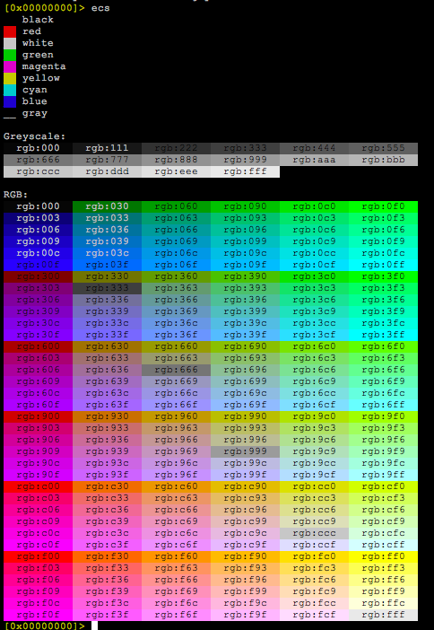

## Цветовая раскраска

Консольный доступ заключен в API, позволяющий отображать выходные данные любой команды при помощи ANSI, W32 Console или HTML. Это позволяет ядру радара работать в средах с ограниченными возможностями отображения, таких как командная строка и встроенные устройства. С них по-прежнему можно получать данные в предпочитаемом формате.

Чтобы включить поддержку цветов по умолчанию, добавьте соответствующий параметр конфигурации в конфигурационный файл `.radare2`:
```
$ echo 'e scr.color=1' >> ~/.radare2rc
```
Обратите внимание, что включение цветов не является логическим параметром, а числом, обозначающим разные уровни глубины цвета, *режимы*:

* 0: Черно-белый,
* 1: 16 основных цветов ANSI,
* 2: 256 цветов в виде шкалы,
* 3: 24-битный truecolor.

Причина наличия таких настроек заключается в том, что нет стандартного или портативного способа для терминальных программ запрашивать консоль для определения наилучшей конфигурации, то же самое касается кодировок наборов символов, поэтому r2 позволяет выбрать это вручную.

Обычно последовательные консоли работают с режимами 0 или 1, в то время как xterms могут поддерживать до уровня 3. RCons попытается найти наиболее близкую цветовую схему для вашей темы, когда вы выбираете новую тему с помощью команды `eco`.

Есть возможность настроить цвет практически любого элемента вывода дизассемблера. Для терминалов *NIX r2 принимает спецификацию цвета в формате RGB. Для изменения цветовой палитры консоли используйте команду `ec`. Команда `ecs` отображает цветовую палитру, помогающую с выбором цветов:



## Темы

Можно создать свою собственную цветовую тему, хотя у radare2 итак есть уже предопределенные. Используйте команду `eco`, чтобы перечислить и выбрать одну из их. После выбора одной можно сравнить ее цветовую схему с текущей темой, нажав клавиши CTRL+SHIFT, а затем клавишу со стрелкой вправо для переключателя. В визуальном режиме используйте клавишу `R` для генерирования случайной палитры цветов или выбора следующей темы в списке.
