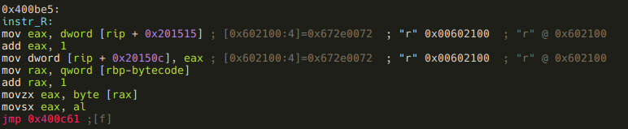
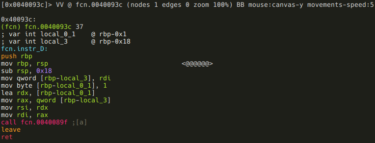
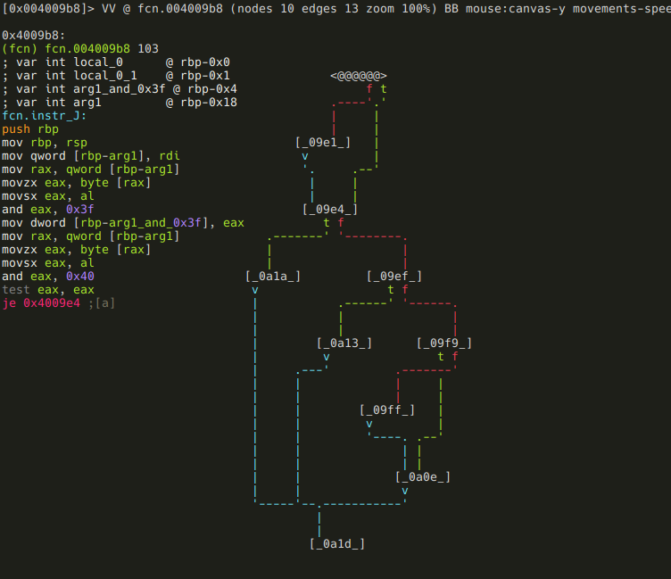
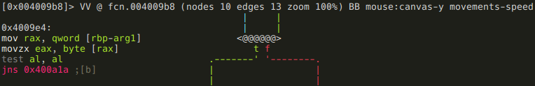
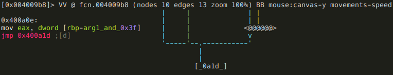

.vmloop
-------

```
[offset]> fcn.vmloop
```


Кажется наша публикация разочаровывающе коротка, но не беспокойтесь, у нас есть много чего можно взломать. Все дело в том, что эта функция использует таблицу переходов по адресу 0x00400a74,


и r2 пока не может распознать таблицы переходов
([Выпуск 3201](https://github.com/radareorg/radare2/issues/3201)), так что анализ
этой функции неполон. Использование графа управления не дает полной информации, поэтому надо либо использовать визуальный режим, либо вносить исправления в блоки. Двоичный код функция всего 542 байта, можно ее взломать и без
использования графа.  Наша цель - использовать как можно больше возможностей r2, и имеет сысл показать, как определять блоки.

Давайте проанализируем то, что у нас уже есть! Во-первых, *rdi* помещается в local_3.
Поскольку приложение является 64-битным исполняемым файлом Linux, известно, что *rdi* - это первый аргумент функции (как вы, возможно, поняли, автоматический анализ аргументов и локальных переменных не был полностью корректным и полным). Также известно, что
первым аргументом *vmloop* является байт-код. Переименуем local_3:

```
:> afvn local_3 bytecode
```

Затем *sym.memory* помещается в другую локальную переменную по адресу *rbp-8* , нераспознанные r2. Давайте определим ее!

```
:> afv 8 memory qword
```

> ***Совет от r2:*** Команда *afv [idx] [name] [type]</g3 используется для определения локальной
> переменной с [указателем фрейма - idx], именем [name] и типом [type]. Можно также удалять локальные переменные с помощью команды *afv- [idx]*.

В следующем блоке программа проверяет один байт байт-кода, и если он равен 0, функция возвращает 1.


Если этот байт не равен нулю, программа вычитает из него 0x41 и сравнивает результат с 0x17. Если результат больше 0x17, получаем страшное сообщение "Wrong!", и функция возвращает значение 0. Это означает, что допустимые байт-коды - это ASCII-символы в диапазоне от "A" (0x41) до "X" (0x41 + 0x17). Если байт-код действителен, приходим к фрагменту кода, реализующему таблицу переходов:


Адрес первой ячейки таблицы переходов - 0x400ec0, определим эту область памяти как набор qword-ов:

```
[0x00400a74]> s 0x00400ec0
[0x00400ec0]> Cd 8 @@=`?s $$ $$+8*0x17 8`
```

> ***Совет от r2:*** Кроме *?s* все части этой команды знакома, давайте подведем итоги! *Cd* определяет область памяти как данные, а 8
> размер этой области памяти. *@@* — это итератор, выполяющий команду слева для каждого элемента, для которого условие *@@* истинно. В этом примере он содержит список, сгенерированный с помощью команды *?s*. *?s* генерирует список адресов, начиная с текущего смещения (seek) *$$* до seek + 8*0x17 (*$$+8*0x17*) с шагом 8.

Вот как выглядит дизассемблирование после добавления метаданных:

```
[0x00400ec0]> pd 0x18
            ; DATA XREF from 0x00400a76 (unk)
            0x00400ec0 .qword 0x0000000000400a80
            0x00400ec8 .qword 0x0000000000400c04
            0x00400ed0 .qword 0x0000000000400b6d
            0x00400ed8 .qword 0x0000000000400b17
            0x00400ee0 .qword 0x0000000000400c04
            0x00400ee8 .qword 0x0000000000400c04
            0x00400ef0 .qword 0x0000000000400c04
            0x00400ef8 .qword 0x0000000000400c04
            0x00400f00 .qword 0x0000000000400aec
            0x00400f08 .qword 0x0000000000400bc1
            0x00400f10 .qword 0x0000000000400c04
            0x00400f18 .qword 0x0000000000400c04
            0x00400f20 .qword 0x0000000000400c04
            0x00400f28 .qword 0x0000000000400c04
            0x00400f30 .qword 0x0000000000400c04
            0x00400f38 .qword 0x0000000000400b42
            0x00400f40 .qword 0x0000000000400c04
            0x00400f48 .qword 0x0000000000400be5
            0x00400f50 .qword 0x0000000000400ab6
            0x00400f58 .qword 0x0000000000400c04
            0x00400f60 .qword 0x0000000000400c04
            0x00400f68 .qword 0x0000000000400c04
            0x00400f70 .qword 0x0000000000400c04
            0x00400f78 .qword 0x0000000000400b99
```

Теперь видно, что адрес 0x400c04 в таблице активно используется, есть также девять других адресов. Посмотрим сначала 0x400c04!


Выводится сообщение "Wrong!", и функция просто возвращает 0. Это недопустимые инструкции (они являются допустимым байт-кодамм, могут быть, например, параметрами!). Отметим 0x400c04 соответствующим образом:

```
[0x00400ec0]> f not_instr @ 0x0000000000400c04
```

Что касается других адресов, они, кажется, делают что-то существенное, предположим, что адреса соответствуют действительным инструкциям. Пометим их с помощью ASCII-символов:

```
[0x00400ec0]> f instr_A @ 0x0000000000400a80
[0x00400ec0]> f instr_C @ 0x0000000000400b6d
[0x00400ec0]> f instr_D @ 0x0000000000400b17
[0x00400ec0]> f instr_I @ 0x0000000000400aec
[0x00400ec0]> f instr_J @ 0x0000000000400bc1
[0x00400ec0]> f instr_P @ 0x0000000000400b42
[0x00400ec0]> f instr_R @ 0x0000000000400be5
[0x00400ec0]> f instr_S @ 0x0000000000400ab6
[0x00400ec0]> f instr_X @ 0x0000000000400b99
```

Перечисленных адресов нет на графе, определим блоки для них!

> ***Совет от r2:*** Блоки графа управления задаются с помощью команды *afb+*. Надо указать функцию, соответствующую конкретному блоку, адрес первого байта кода и его размер. Если блок заканчивается переходом (jmp), надо указать куда осуществляется переход. Если переход является условным, целевой адрес false-ветви также следует указать.

Получить начальный и конечный адрес каждого блока получается в результате анализа дизассемблированного кода функции *vmloop*.


Ранее мы видели, что сама функция простая, а ее код короткий, простой в изучении особенно с нашими аннотациями. Как обещано, создам недостающие блоки для всех инструкций:

```
[0x00400ec0]> afb+ 0x00400a45 0x00400a80 0x00400ab6-0x00400a80 0x400c15
[0x00400ec0]> afb+ 0x00400a45 0x00400ab6 0x00400aec-0x00400ab6 0x400c15
[0x00400ec0]> afb+ 0x00400a45 0x00400aec 0x00400b17-0x00400aec 0x400c15
[0x00400ec0]> afb+ 0x00400a45 0x00400b17 0x00400b42-0x00400b17 0x400c15
[0x00400ec0]> afb+ 0x00400a45 0x00400b42 0x00400b6d-0x00400b42 0x400c15
[0x00400ec0]> afb+ 0x00400a45 0x00400b6d 0x00400b99-0x00400b6d 0x400c15
[0x00400ec0]> afb+ 0x00400a45 0x00400b99 0x00400bc1-0x00400b99 0x400c15
[0x00400ec0]> afb+ 0x00400a45 0x00400bc1 0x00400be5-0x00400bc1 0x400c15
[0x00400ec0]> afb+ 0x00400a45 0x00400be5 0x00400c04-0x00400be5 0x400c15
```

Из дизассемблированного кода также видно, что кроме блоков инструкций есть еще три блока. Создадим их тоже!

```
[0x00400ec0]> afb+ 0x00400a45 0x00400c15 0x00400c2d-0x00400c15 0x400c3c 0x00400c2d
[0x00400ec0]> afb+ 0x00400a45 0x00400c2d 0x00400c3c-0x00400c2d 0x400c4d 0x00400c3c
[0x00400ec0]> afb+ 0x00400a45 0x00400c3c 0x00400c4d-0x00400c3c 0x400c61
```

Эти блоки начинаются с адресов 0x00400c15 и 0x00400c2d и заканчиваются условными переходами, надо задать также адрес назначения для false-ветви!

И вот граф управления во всей его красе после ручной реструктуризации:


Я думаю, это того стоило? :) На самом деле на реструктуризацию не стоило тратить время, так как он не сохраняется при сохранении проекта.

> ***Совет от r2:*** Можно перемещать выбранный узел в представлении графика с помощью клавиш HJKL.

Кстати, вот как выглядит граф этой же функции в IDA:


Просматривая дизассемблированный код *instr_LETTER* в виде блоков графа, распознаются несколько сущностей. Первое: все инструкции начинаются с последовательности вида


Теперь ясно, что девять dword-ов в *sym.instr_dirty* - это не просто индикаторы того, что инструкция была выполнена, они также используются для подсчета количества вызовов инструкций. Также я должен был понять раньше, что *sym.good_if_le_9* (0x6020f0) является частью этого массива из девяти dword-ов ... ну да... Теперь как-то надо жить с этим... Какой смысл условия "*sym.good_if_le_9* должно быть меньше или равно 9" на самом деле? - *instr_P* не может быть выполнен более девяти раз:


Еще одно некоторое сходство между инструкциями заключается в том, что семь из них вызывает функцию с либо с одним, либо с двумя параметрами, причем параметры - это байт-коды, следующий или два следующих. Пример с одним параметром:


И пример с двумя параметрами:


Известно также, что эти блоки помещают в локальную переменную по адресу 0xc количество байтов, которые они "отъедают" от байт-кода (1 байт инструкции + 1 или 2 байта аргументов = 2 или 3). r2 не распознал эту переменную, давайте обозначим ее вручную!

```
:> afv 0xc instr_ptr_step dword
```

Посмотрим на *instr_J* и увидим, что это исключение из приведенного выше правила, так как она помещает возвращаемое значение вызываемой функции в *instr_ptr_step* вместо константы 2 или 3:


И, продолжая изучать исключения, вот две инструкции, которые не вызывают функции:



Эта инструкция просто помещает следующий байт-код (первый аргумент) в *eax*, и переходит в конец *vmloop*. Итак, добравшись до инструкции *ret* виртуальной машины, тепарь мы знаем, что *vmloop* должна возвращать "\*", поэтому "R\*" должен быть последними двумя байтами нашего байт-кода.

Следующая инструкция не вызывает функцию:


Это инструкция с одним аргументом, и она записывает свой аргумент по адресу 0x6020c0. Установим флаг на этот адрес!

```
:> f sym.written_by_instr_C 4 @ 0x6020c0
```

О, у меня предчувствие, что инструкции *instr_C* также в исходном коде crackme соответствовал вызов функции, но он был соптимизирован компилятором (inlined). Во всяком случае, у нас есть вот эти две инструкции:

- *instr_R(a1):* выходит с *a1*
- *instr_C(a1):* сохраняет *a1* в *sym.written_by_instr_C*

Также известно, что они принимают один аргумент,

- instr_I
- instr_D
- instr_P
- instr_X
- instr_J

я эти принимают два аргумента:

- instr_A
- instr_S

Остается взломать семь функций, которые вызываются инструкциями, потом построить действительную последовательность байт-кода, дающей нам желанный флаг.

### instr_A

Функция, которую вызывает эта инструкция, находится по адресу 0x40080d, поэтому давайте изучать ее!

```
[offset]> 0x40080d
```

> ***Совет от r2:*** В визуальном режиме вы можете просто нажать \<Enter\> на строке перехода (jmp и др.) или вызова call, и r2 установит смещение (seek) на адрес назначения.

Если попробуем перейти на этот адрес в режиме графа управления, получим сообщение: "Not in a function". Введите 'df' и задайте его прямо здесь. Функция вызывается из блока r2, который был не распознался, поэтому r2 не удалось найти эту функцию. Повенуемся и введем *df*! Функция определена, но нам нужно осмысленное название для нее. Наберем *dr*, находясь все еще в визуальном режиме,
назовем эту функцию *instr_A*!


> ***Совет от r2:*** Все эти команды являются частью меню в визуальном режиме, впервые использованного для определения *sym.memory* как блока данных: *Cd*.

Теперь у нас есть наша новая *fcn.instr_A*, взломаем и ее! Из формы миникарты видно, что есть какой-то каскад if-then-elif или оператор switch-case в теле этой функции. Это одина из причин, почему миникарта так полезна: можно визуально распознать шаблоны кода, помогающие при анализе (вспомните легко узнаваемый шаблон цикла нескольких абзацев тому назад). Итак, признаем, что миникарта классная и полезная, но я еще не показал все возможности режима графа управления, давайте сделаем все, что нужно в этом режиме. Первые блоки:


Два аргумента функции (*RDI* и *RSI*) сохраняются в локальных переменных, затем первый сравнивается с 0. Если это так, функция завершается (можно видеть это на миникарте), в противном случае эта же проверка выполняется по второму аргументу. Функция завершается, если и второй аргумент равен нулю. Код функции крошечный, но будем придерживаться используемой методологии и переименуем локальные переменные:

```
:> afvn local_1 arg1
:> afvn local_2 arg2
```

Мы пришли к ранее распознанному оператору switch-case, теперь видно, что значение *arg1* сверяется с "M", "P" и "C".


Ветвь "М":


Он загружает адрес из ячейки 0x602088 и суммирует *arg2* с байтом по этому адресу. Программа r2 показывает нам в комментарии, что 0x602088 изначально содержит адрес *sym.memory*, область памяти нужно сконструировать строку "Such VM!
MuCH reV3rse!" string. Можно предположить, что надо как-то менять значение, хранящееся по адресу 0x602088, получается, что ветвь «M» может менять байты, отличные от первого. Исходя из этого предположения, пометим 0x602088 как *sym.current_memory_ptr*:

```
:> f sym.current_memory_ptr 8 @ 0x602088
```

Переходим к ветке "P":


Фрагмент кода, позволяющий модифицировать *sym.current_memory_ptr*: он прибавляет к нему *arg2*.

Наконец, ветвь "C":


Оказывается *instr_C* - это не единственная инструкция, изменяющая *sym.written_by_instr_C*: этот фрагмент кода прибавляет к нему *arg2*.

Мы взломали *instr_A*, подведем итоги! В зависимости от первого аргумента, это инструкция исполняет следующее:

- *arg1* == "M": прибавляет *arg2* к байту по адресу *sym.current_memory_ptr*.
- *arg1* == "P": смещает *sym.current_memory_ptr* на *arg2* байтов.
- *arg1* == "C": прибавляет *arg2* к значению по адресу *sym.written_by_instr_C*.

### instr_S

Эта функция также не распозналась автоматически, зададим вручную ее аналогично *instr_A*. После этого посмотрим на миникарту, поперемещаем диаграмму, теперь очевидно, что эти две функции очень похожи. Можно также использовать *radiff2* для построения диаграммы различий (diff).

> ***Совет от r2:*** Программа radiff2 используется для сравнения двоичных файлов. Есть возможность управлять способом анализа двоичных файлов, и требуемым форматом результата. Интересной функцией является порождение графов вида [DarumGrim](http://www.darungrim.org/) с использованием флага *-g*.

Нам надо сравнить две функции из одного и того же двоичного файла, поэтому указываем смещения при помощи флага *-g*, далее применяем reverse4 для обоих двоичных файлов. Итак, создадим графы сравнения *instr_A* с *instr_S* и сравнения *instr_S* с *instr_A*.

```
[0x00 ~]$ radiff2 -g 0x40080d,0x40089f  reverse4 reverse4 | xdot -
```


```
[0x00 ~]$ radiff2 -g 0x40089f,0x40080d  reverse4 reverse4 | xdot -
```


Печальная правда раскрывается после беглого взгляда на эти графы: radiff2 лжет! Теоретически серые блоки должны быть идентичными, желтые должны отличаться только в некоторых адресах, причем красные должны серьезно различаться. Очевидно, что большие серые блоки явно неодинаковы. Определенно надо рыть глубже даже после того, как я закончу эту статью.

Отойдя от шока, созданного лживым инструментом, легко понимаем,
что *instr_S* в по сути является обратной *instr_A*, при этом последний прибавляет, а первый вычитает. Подведем итог:

- *arg1* == "M": вычитает *arg2* из байта по адресу *sym.current_memory_ptr*.
- *arg1* == "P": смещает *sym.current_memory_ptr* назад на *arg2* байт.
- *arg1* == "C": вычитает *arg2* из згачения по адресу *sym.written_by_instr_C*.

### instr_I


Инструкция просто вызывает *instr_A(arg1, 1)*. Заметим, что запуск функции выглядит как `call fcn.0040080d` вместо `call fcn.instr_A`.
В текущей версии при сохранении и открытии проекта имена функций теряются - еще один момент для исправления в r2!

### instr_D



Опять же, все просто: она вызывает *instr_S(arg1, 1)*.

### instr_P

Время переименовать ее локальные переменные!

```
:> afvn local_0_1 const_M
:> afvn local_0_2 const_P
:> afvn local_3 arg1
```


Функция также проста, но есть одна странность: const_M не используется. Это вероятно какое-то отвлечение внимания хакера?... По сути функция просто сохраняет *arg1* в *sym.current_memory_ptr*, а затем вызывает *instr_I("P")*. Это означает, что *instr_P* сохранает один байт и переводит указатель на следующий байт.
Кажется, эта инструкция идеальна для построения большей части строки "Such VM!
MuCH reV3rse!", но ее можно использовать только девять раз!

### instr_X

Переименовываем локальные переменные ... ну как всегда!

```
:> afvn local_1 arg1
```


Функция выполняет операцию XOR со значением по адресу *sym.current_memory_ptr* с *arg1*.

### instr_J

Функция не так проста, как предыдущие, но при этом и не сложна. Одержимость переименованием переменных приводит к

```
:> afvn local_3 arg1
:> afvn local_0_4 arg1_and_0x3f
```



После помещения *arg1 & 0x3f* в локальную переменную, *arg1 & 0x40* сравнивается с 0. Если результат не равен нулю, биты *arg1_and_0x3f* инвертируются:


Следующее ветвление: если *arg1* >= 0, то функция возвращает *arg1_and_0x3f*,




в противном случае функция разветвляется снова в зависимости от значения *sym.written_by_instr_C*:


Если оно равно нулю, функция возвращает 2,


иначе проверяется, является ли *arg1_and_0x3f* отрицательным числом,


и если это так, то *sym.good_if_ne_zero* увеличивается на 1:


После всех проверок функция возвращает *arg1_and_0x3f*:


