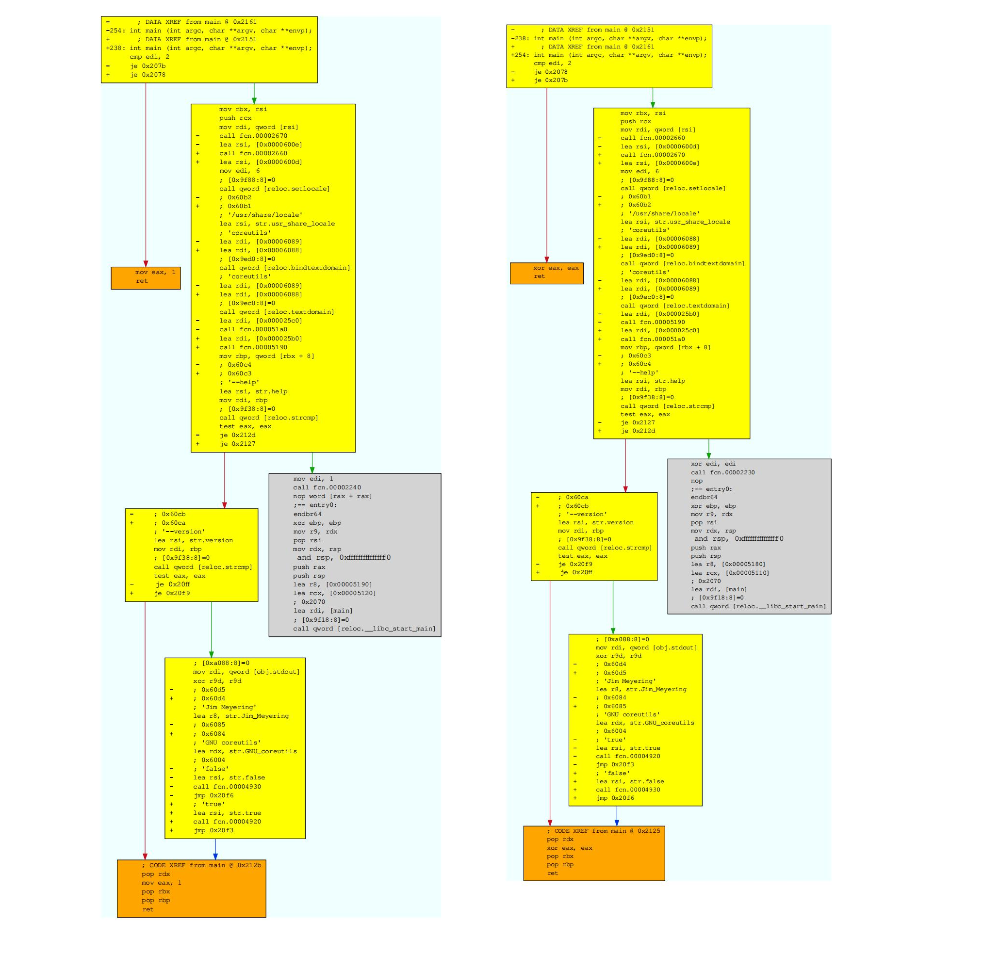

# Бинарное сравнение

Этот раздел основан на http://radare.today статье "[двоичное сравнение](https://radareorg.github.io/blog/posts/binary-diffing/)"

Без параметров `radiff2` по умолчанию показывает, какие байты изменены и соответствующие им смещения:
```
$ radiff2 genuine cracked      # оригинальный взломанный
0x000081e0 85c00f94c0 => 9090909090 0x000081e0
0x0007c805 85c00f84c0 => 9090909090 0x0007c805

$ rasm2 -d 85c00f94c0
test eax, eax
sete al
```
Заметим, два перехода (jumps) заменены на nop-ы.

Для массовой обработки может потребоваться более высокоуровневый обзор различий. Вот почему radare2 может вычислять расстояние и процент сходства между двумя файлами с помощью опции `-s`:
```
$ radiff2 -s /bin/true /bin/false
similarity: 0.97
distance: 743
```

Если нужны более конкретные данные, можно подсчитать различия с помощью параметра `-c`:
```
$ radiff2 -c genuine cracked
2
```

Если нет уверенности, похожи ли двоичные файлы, с флагом `-C` можно проверить, есть ли соответствующие функции. В этом режиме, он даст вам три столбца для всех функций: «Смещение первого файла», «Процент совпадения» и «Смещение второго файла».

```
$ radiff2 -C /bin/false /bin/true
  entry0  0x4013e8 |   MATCH  (0.904762) | 0x4013e2  entry0
  sym.imp.__libc_start_main  0x401190 |   MATCH  (1.000000) | 0x401190  sym.imp.__libc_start_main
  fcn.00401196  0x401196 |   MATCH  (1.000000) | 0x401196  fcn.00401196
  fcn.0040103c  0x40103c |   MATCH  (1.000000) | 0x40103c  fcn.0040103c
  fcn.00401046  0x401046 |   MATCH  (1.000000) | 0x401046  fcn.00401046
  fcn.000045e0   24 0x45e0 | UNMATCH  (0.916667) | 0x45f0    24 fcn.000045f0
  ...
```
Можно попросить radiff2 сначала выполнить анализ - флаг `-A` запустит `aaa` на двоичных файлах. И мы можем указать архитектуру двоичных файлов для этого анализа, используя
```
$ radiff2 -AC -a x86 /bin/true /bin/false | grep UNMATCH
[x] Анализировать все флаги, начиная с sym. и entry0 (aa)
[x] Анализировать len байт инструкций на ссылки (aar)
[x] Анализировать вызовы функций (aac)
[ ] [*] Использование -AA или aaaa запускают дополнительные экспериментальные алгоритмы анализа.
[x] Создание имен функций для fcn.* и sym.func.* (aan))
[x] Анализировать все флаги, начиная с sym. и entry0 (aa)
[x] Анализировать len байт инструкций на ссылки (aar)
[x] Анализировать вызовы функций (aac)
[ ] [*] Использование -AA или aaaa запускают дополнительные экспериментальные алгоритмы анализа.
[x] Создание имен функций для fcn.* и sym.func.* (aan))
                        sub.fileno_500   86 0x4500 | UNMATCH  (0.965116) | 0x4510    86 sub.fileno_510
                    sub.__freading_4c0   59 0x44c0 | UNMATCH  (0.949153) | 0x44d0    59 sub.__freading_4d0
                        sub.fileno_440  120 0x4440 | UNMATCH  (0.200000) | 0x4450   120 sub.fileno_450
                     sub.setlocale_fa0   64 0x3fa0 | UNMATCH  (0.104651) | 0x3fb0    64 sub.setlocale_fb0
                          fcn.00003a50  120 0x3a50 | UNMATCH  (0.125000) | 0x3a60   120 fcn.00003a60
```

Теперь классная функция - radare2 поддерживает сравнения графов, как в [DarunGrim](http://www.darungrim.org/), флаг - `-g`. Можно присвоить имя символа, указав два смещения, если функция, которую вы хотите сравнить, называется по-разному в сравниваемых файлах. Например, `radiff2 -md -g main /bin/true /bin/false | xdot -` покажет различия в функции `main()` программ Unix `true` и `false`. Можно сравнить его с `radiff2 -md -g main /bin/false /bin/true | xdot -` (обратите внимание на порядок аргументов), чтобы получить две версии.
Вот, что из этого получилось:



Части желтого цвета указывают, что некоторые смещения не совпадают. Серый кусок означает идеальное соответствие. Оранжевый подчеркивает сильную разницу. Если присмотреться, то увидим, что в левой части картинки есть `mov eax, 0x1; pop rbx; pop rbp; ret`, а в правой части - `xor edx, edx; pop rbx; pop rbp; ret`.

Двоичное сравнение является важной функцией для обратного проектирования. Его можно использовать для анализа [обновлений безопасности](https://en.wikipedia.org/wiki/Patch_Tuesday), зараженных двоичных файлов, изменений прошивки и многого другого...

Мы показали только функции анализа кода, но radare2 поддерживает дополнительные типы сравнения между двумя двоичными файлами: на уровне байтов, дельтифицированные сходства и многое другое в будущем.

Есть планы по внедрению большего количества видов алгоритмов в r2: добавить поддержку дифференциации ASCII-арт-графов и лучшую интеграцию с остальной частью инструментария.
