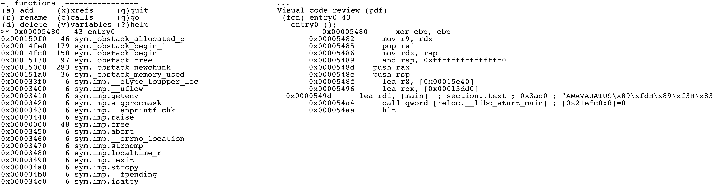

# Code Analysis

Code analysis is a common technique used to extract information from assembly code.

Radare2 has different code analysis techniques implemented in the core and available in different commands.

As long as the whole functionalities of r2 are available with the API as well as using commands. This gives you the ability to implement your own analysis loops using any programming language, even with r2 oneliners, shellscripts, or analysis or core native plugins.

The analysis will show up the internal data structures to identify basic blocks, function trees and to extract opcode-level information.

The most common radare2 analysis command sequence is `aa`, which stands for "analyze all". That all is referring to all symbols and entry-points. If your binary is stripped you will need to use other commands like `aaa`, `aab`, `aar`, `aac` or so.

Take some time to understand what each command does and the results after running them to find the best one for your needs.

```
[0x08048440]> aa
[0x08048440]> pdf @ main
		   ; DATA XREF from 0x08048457 (entry0)
/ (fcn) fcn.08048648 141
|     ;-- main:
|     0x08048648    8d4c2404     lea ecx, [esp+0x4]
|     0x0804864c    83e4f0       and esp, 0xfffffff0
|     0x0804864f    ff71fc       push dword [ecx-0x4]
|     0x08048652    55           push ebp
|     ; CODE (CALL) XREF from 0x08048734 (fcn.080486e5)
|     0x08048653    89e5         mov ebp, esp
|     0x08048655    83ec28       sub esp, 0x28
|     0x08048658    894df4       mov [ebp-0xc], ecx
|     0x0804865b    895df8       mov [ebp-0x8], ebx
|     0x0804865e    8975fc       mov [ebp-0x4], esi
|     0x08048661    8b19         mov ebx, [ecx]
|     0x08048663    8b7104       mov esi, [ecx+0x4]
|     0x08048666    c744240c000. mov dword [esp+0xc], 0x0
|     0x0804866e    c7442408010. mov dword [esp+0x8], 0x1 ;  0x00000001
|     0x08048676    c7442404000. mov dword [esp+0x4], 0x0
|     0x0804867e    c7042400000. mov dword [esp], 0x0
|     0x08048685    e852fdffff   call sym..imp.ptrace
|        sym..imp.ptrace(unk, unk)
|     0x0804868a    85c0         test eax, eax
| ,=< 0x0804868c    7911         jns 0x804869f
| |   0x0804868e    c70424cf870. mov dword [esp], str.Don_tuseadebuguer_ ;  0x080487cf
| |   0x08048695    e882fdffff   call sym..imp.puts
| |      sym..imp.puts()
| |   0x0804869a    e80dfdffff   call sym..imp.abort
| |      sym..imp.abort()
| `-> 0x0804869f    83fb02       cmp ebx, 0x2
|,==< 0x080486a2    7411         je 0x80486b5
||    0x080486a4    c704240c880. mov dword [esp], str.Youmustgiveapasswordforusethisprogram_ ;  0x0804880c
||    0x080486ab    e86cfdffff   call sym..imp.puts
||       sym..imp.puts()
||    0x080486b0    e8f7fcffff   call sym..imp.abort
||       sym..imp.abort()
|`--> 0x080486b5    8b4604       mov eax, [esi+0x4]
|     0x080486b8    890424       mov [esp], eax
|     0x080486bb    e8e5feffff   call fcn.080485a5
|        fcn.080485a5() ; fcn.080484c6+223
|     0x080486c0    b800000000   mov eax, 0x0
|     0x080486c5    8b4df4       mov ecx, [ebp-0xc]
|     0x080486c8    8b5df8       mov ebx, [ebp-0x8]
|     0x080486cb    8b75fc       mov esi, [ebp-0x4]
|     0x080486ce    89ec         mov esp, ebp
|     0x080486d0    5d           pop ebp
|     0x080486d1    8d61fc       lea esp, [ecx-0x4]
\     0x080486d4    c3           ret
```

In this example, we analyze the whole file (`aa`) and then print disassembly of the `main()` function (`pdf`).
The `aa` command belongs to the family of auto analysis commands and performs only the most basic
auto analysis steps. In radare2 there are many different types of the auto analysis commands with a
different analysis depth, including partial emulation: `aa`, `aaa`, `aab`, `aaaa`, ...
There is also a mapping of those commands to the r2 CLI options: `r2 -A`, `r2 -AA`, and so on.

It is a common sense that completely automated analysis can produce non sequitur results, thus
radare2 provides separate commands for the particular stages of the analysis allowing fine-grained
control of the analysis process. Moreover, there is a treasure trove of configuration variables
for controlling the analysis outcomes. You can find them in `anal.*` and `emu.*`
cfg variables' namespaces.

## Analyze functions

One of the most important "basic" analysis commands is the set of `af` subcommands. `af` means
"analyze function". Using this command you can either allow automatic analysis of the particular
function or perform completely manual one.

```
[0x00000000]> af?
|Usage: af
| af ([name]) ([addr])     analyze functions (start at addr or $$)
| afr ([name]) ([addr])    analyze functions recursively
| af+ addr name [type] [diff]  hand craft a function (requires afb+)
| af- [addr]               clean all function analysis data (or function at addr)
| afb+ fcnA bbA sz [j] [f] ([t]( [d]))  add bb to function @ fcnaddr
| afb[?] [addr]            List basic blocks of given function
| afbF([0|1])              Toggle the basic-block 'folded' attribute
| afB 16                   set current function as thumb (change asm.bits)
| afC[lc] ([addr])@[addr]  calculate the Cycles (afC) or Cyclomatic Complexity (afCc)
| afc[?] type @[addr]      set calling convention for function
| afd[addr]                show function + delta for given offset
| aff                      re-adjust function boundaries to fit
| afF[1|0|]                fold/unfold/toggle
| afi [addr|fcn.name]      show function(s) information (verbose afl)
| afj [tableaddr] [count]  analyze function jumptable
| afl[?] [ls*] [fcn name]  list functions (addr, size, bbs, name) (see afll)
| afm name                 merge two functions
| afM name                 print functions map
| afn[?] name [addr]       rename name for function at address (change flag too)
| afna                     suggest automatic name for current offset
| afo[?j] [fcn.name]       show address for the function name or current offset
| afs[!] ([fcnsign])       get/set function signature at current address (afs! uses cfg.editor)
| afS[stack_size]          set stack frame size for function at current address
| afsr [function_name] [new_type]  change type for given function
| aft[?]                   type matching, type propagation
| afu [addr]               resize and analyze function from current address until addr
| afv[absrx]?               manipulate args, registers and variables in function
| afx                      list function references
```
You can use `afl` to list the functions found by the analysis.

There are a lot of useful commands under `afl` such as `aflj`, which lists the function in JSON format and `aflm`, which lists the functions in the syntax found in makefiles.

There's also `afl=`, which displays ASCII-art bars with function ranges.

You can find the rest of them under `afl?`.

Some of the most challenging tasks while performing a function analysis are merge, crop and resize.
As with other analysis commands you have two modes: semi-automatic and manual.
For the semi-automatic, you can use `afm <function name>` to merge the current function with
the one specified by name as an argument, `aff` to readjust the function after analysis changes or function edits,
`afu <address>` to do the resize and analysis of the current function until the specified address.

Apart from those semi-automatic ways to edit/analyze the function, you can hand craft it in the manual mode with `af+` command and edit basic blocks of it using `afb` commands.
Before changing the basic blocks of the function it is recommended to check the already presented ones:

```
[0x00003ac0]> afb
0x00003ac0 0x00003b7f 01:001A 191 f 0x00003b7f
0x00003b7f 0x00003b84 00:0000 5 j 0x00003b92 f 0x00003b84
0x00003b84 0x00003b8d 00:0000 9 f 0x00003b8d
0x00003b8d 0x00003b92 00:0000 5
0x00003b92 0x00003ba8 01:0030 22 j 0x00003ba8
0x00003ba8 0x00003bf9 00:0000 81
```

There are two very important commands for this: `afc` and `afB`. The latter is a must-know command for some platforms like ARM. It provides a way to change the "bitness" of the particular function. Basically, allowing to select between ARM and Thumb modes.

`afc` on the other side, allows to manually specify function calling convention. You can find more information on its usage in [calling_conventions](calling_conventions.md).

## Recursive analysis

There are 5 important program wide half-automated analysis commands:

 - `aab` - perform basic-block analysis ("Nucleus" algorithm)
 - `aac` - analyze function calls from one (selected or current function)
 - `aaf` - analyze all function calls
 - `aar` - analyze data references
 - `aad` - analyze pointers to pointers references

Those are only generic semi-automated reference searching algorithms. Radare2 provides a
wide choice of manual references' creation of any kind. For this fine-grained control
you can use `ax` commands.

```
Usage: ax[?d-l*]   # see also 'afx?'
| ax              list refs
| ax*             output radare commands
| ax addr [at]    add code ref pointing to addr (from curseek)
| ax- [at]        clean all refs/refs from addr
| ax-*            clean all refs/refs
| axc addr [at]   add generic code ref
| axC addr [at]   add code call ref
| axg [addr]      show xrefs graph to reach current function
| axg* [addr]     show xrefs graph to given address, use .axg*;aggv
| axgj [addr]     show xrefs graph to reach current function in json format
| axd addr [at]   add data ref
| axq             list refs in quiet/human-readable format
| axj             list refs in json format
| axF [flg-glob]  find data/code references of flags
| axm addr [at]   copy data/code references pointing to addr to also point to curseek (or at)
| axt [addr]      find data/code references to this address
| axf [addr]      find data/code references from this address
| axv [addr]      list local variables read-write-exec references
| ax. [addr]      find data/code references from and to this address
| axff[j] [addr]  find data/code references from this function
| axs addr [at]   add string ref
```

The most commonly used `ax` commands are `axt` and `axf`, especially as a part of various r2pipe
scripts. Lets say we see the string in the data or a code section and want to find all places
it was referenced from, we should use `axt`:

```
[0x0001783a]> pd 2
;-- str.02x:
; STRING XREF from 0x00005de0 (sub.strlen_d50)
; CODE XREF from 0x00017838 (str.._s_s_s + 7)
0x0001783a     .string "%%%02x" ; len=7
;-- str.src_ls.c:
; STRING XREF from 0x0000541b (sub.free_b04)
; STRING XREF from 0x0000543a (sub.__assert_fail_41f + 27)
; STRING XREF from 0x00005459 (sub.__assert_fail_41f + 58)
; STRING XREF from 0x00005f9e (sub._setjmp_e30)
; CODE XREF from 0x0001783f (str.02x + 5)
0x00017841 .string "src/ls.c" ; len=9
[0x0001783a]> axt
sub.strlen_d50 0x5de0 [STRING] lea rcx, str.02x
(nofunc) 0x17838 [CODE] jae str.02x
```

There are also some useful commands under `axt`. Use `axtg` to generate radare2 commands which will help you to create graphs according to the XREFs.

```
[0x08048320]> s main
[0x080483e0]> axtg
agn 0x8048337 "entry0 + 23"
agn 0x80483e0 "main"
age 0x8048337 0x80483e0
```

Use `axt*` to split the radare2 commands and set flags on those corresponding XREFs.

Also under `ax` is `axg`, which finds the path between two points in the file by showing an XREFs graph to reach the location or function. For example:

```
:> axg sym.imp.printf
- 0x08048a5c fcn 0x08048a5c sym.imp.printf
  - 0x080483e5 fcn 0x080483e0 main
  - 0x080483e0 fcn 0x080483e0 main
    - 0x08048337 fcn 0x08048320 entry0
  - 0x08048425 fcn 0x080483e0 main
```
Use `axg*` to generate radare2 commands which will help you to create graphs using `agn` and `age` commands, according to the XREFs.

Apart from predefined algorithms to identify functions there is a way to specify
a function prelude with a configuration option `anal.prelude`. For example, like
`e anal.prelude = 0x554889e5` which means

```
push rbp
mov rbp, rsp
```

on x86\_64 platform. It should be specified _before_ any analysis commands.

## Configuration

Radare2 allows to change the behavior of almost any analysis stages or commands.
There are different kinds of the configuration options:

 - Flow control
 - Basic blocks control
 - References control
 - IO/Ranges
 - Jump tables analysis control
 - Platform/target specific options

### Control flow configuration

Two most commonly used options for changing the behavior of control flow analysis in radare2 are
`anal.hasnext` and `anal.afterjump`. The first one allows forcing radare2 to continue the analysis
after the end of the function, even if the next chunk of the code wasn't called anywhere, thus
analyzing all of the available functions. The latter one allows forcing radare2 to continue
the analysis even after unconditional jumps.

In addition to those we can also set `anal.ijmp` to follow the indirect jumps, continuing analysis;
`anal.pushret` to analyze `push ...; ret` sequence as a jump; `anal.nopskip` to skip the NOP
sequences at a function beginning.

For now, radare2 also allows you to change the maximum basic block size with `anal.bb.maxsize` option
. The default value just works in most use cases, but it's useful to increase that for example when
dealing with obfuscated code. Beware that some of basic blocks
control options may disappear in the future in favor of more automated ways to set those.

For some unusual binaries or targets, there is an option `anal.noncode`. Radare2 doesn't try
to analyze data sections as a code by default. But in some cases - malware, packed binaries,
binaries for embedded systems, it is often a case. Thus - this option.

### Reference control

The most crucial options that change the analysis results drastically. Sometimes some can be
disabled to save the time and memory when analyzing big binaries.

- `anal.jmpref` - to allow references creation for unconditional jumps
- `anal.cjmpref` - same, but for conditional jumps
- `anal.datarefs` - to follow the data references in code
- `anal.refstr` - search for strings in data references
- `anal.strings` - search for strings and creating references

Note that strings references control is disabled by default because it increases the analysis time.

### Analysis ranges

There are a few options for this:

- `anal.limits` - enables the range limits for analysis operations
- `anal.from` - starting address of the limit range
- `anal.to` - the corresponding end of the limit range
- `anal.in` - specify search boundaries for analysis. You can set it to `io.maps`, `io.sections.exec`, `dbg.maps` and many more. For example:
  - To analyze a specific memory map with `anal.from` and `anal.to`, set `anal.in = dbg.maps`.
  - To analyze in the boundaries set by `anal.from` and `anal.to`, set `anal.in=range`.
  - To analyze in the current mapped segment or section, you can put `anal.in=bin.segment` or `anal.in=bin.section`, respectively.
  - To analyze in the current memory map, specify `anal.in=dbg.map`.
  - To analyze in the stack or heap, you can set `anal.in=dbg.stack` or `anal.in=dbg.heap`.
  - To analyze in the current function or basic block, you can specify `anal.in=anal.fcn` or `anal.in=anal.bb`.

Please see `e anal.in=??` for the complete list.

### Jump tables

Jump tables are one of the trickiest targets in binary reverse engineering. There are hundreds
of different types, the end result depending on the compiler/linker and LTO stages of optimization.
Thus radare2 allows enabling some experimental jump tables detection algorithms using `anal.jmptbl`
option. Eventually, algorithms moved into the default analysis loops once they start to work on
every supported platform/target/testcase.
Two more options can affect the jump tables analysis results too:

- `anal.ijmp` - follow the indirect jumps, some jump tables rely on them
- `anal.datarefs` - follow the data references, some jump tables use those

### Platform specific controls

There are two common problems when analyzing embedded targets: ARM/Thumb detection and MIPS GP
value. In case of ARM binaries radare2 supports some auto-detection of ARM/Thumb mode switches, but
beware that it uses partial ESIL emulation, thus slowing the analysis process. If you will not
like the results, particular functions' mode can be overridden with `afB` command.

The MIPS GP problem is even trickier. It is a basic knowledge that GP value can be different not only
for the whole program, but also for some functions. To partially solve that there are options
`anal.gp` and `anal.gp2`. The first one sets the GP value for the whole program or particular
function. The latter allows to "constantify" the GP value if some code is willing to change its
value, always resetting it if the case. Those are heavily experimental and might be changed in the
future in favor of more automated analysis.

## Visuals

One of the easiest way to see and check the changes of the analysis commands and variables
is to perform a scrolling in a `Vv` special visual mode, allowing functions preview:



When we want to check how analysis changes affect the result in the case of big functions, we can
use minimap instead, allowing to see a bigger flow graph on the same screen size. To get into
the minimap mode type `VV` then press `p` twice:


This mode allows you to see the disassembly of each node separately, just navigate between them using `Tab` key.

## Analysis hints

It is not an uncommon case that analysis results are not perfect even after you tried every single
configuration option. This is where the "analysis hints" radare2 mechanism comes in. It allows
to override some basic opcode or meta-information properties, or even to rewrite the whole opcode
string. These commands are located under `ah` namespace:

```
Usage: ah[lba-]  Analysis Hints
| ah?                show this help
| ah? offset         show hint of given offset
| ah                 list hints in human-readable format
| ah.                list hints in human-readable format from current offset
| ah-                remove all hints
| ah- offset [size]  remove hints at given offset
| ah* offset         list hints in radare commands format
| aha ppc @ 0x42     force arch ppc for all addrs >= 0x42 or until the next hint
| aha 0 @ 0x84       disable the effect of arch hints for all addrs >= 0x84 or until the next hint
| ahb 16 @ 0x42      force 16bit for all addrs >= 0x42 or until the next hint
| ahb 0 @ 0x84       disable the effect of bits hints for all addrs >= 0x84 or until the next hint
| ahc 0x804804       override call/jump address
| ahd foo a0,33      replace opcode string
| ahe 3,eax,+=       set vm analysis string
| ahf 0x804840       override fallback address for call
| ahF 0x10           set stackframe size at current offset
| ahh 0x804840       highlight this address offset in disasm
| ahi[?] 10          define numeric base for immediates (2, 8, 10, 10u, 16, i, p, S, s)
| ahj                list hints in JSON
| aho call           change opcode type (see aho?) (deprecated, moved to "ahd")
| ahp addr           set pointer hint
| ahr val            set hint for return value of a function
| ahs 4              set opcode size=4
| ahS jz             set asm.syntax=jz for this opcode
| aht [?] <type>     Mark immediate as a type offset (deprecated, moved to "aho")
| ahv val            change opcode's val field (useful to set jmptbl sizes in jmp rax)
```

One of the most common cases is to set a particular numeric base for immediates:

```
[0x00003d54]> ahi?
Usage: ahi [2|8|10|10u|16|bodhipSs] [@ offset]   Define numeric base
| ahi <base>  set numeric base (2, 8, 10, 16)
| ahi 10|d    set base to signed decimal (10), sign bit should depend on receiver size
| ahi 10u|du  set base to unsigned decimal (11)
| ahi b       set base to binary (2)
| ahi o       set base to octal (8)
| ahi h       set base to hexadecimal (16)
| ahi i       set base to IP address (32)
| ahi p       set base to htons(port) (3)
| ahi S       set base to syscall (80)
| ahi s       set base to string (1)

[0x00003d54]> pd 2
0x00003d54      0583000000     add eax, 0x83
0x00003d59      3d13010000     cmp eax, 0x113
[0x00003d54]> ahi d
[0x00003d54]> pd 2
0x00003d54      0583000000     add eax, 131
0x00003d59      3d13010000     cmp eax, 0x113
[0x00003d54]> ahi b
[0x00003d54]> pd 2
0x00003d54      0583000000     add eax, 10000011b
0x00003d59      3d13010000     cmp eax, 0x113
```

It is notable that some analysis stages or commands add the internal analysis hints,
which can be checked with `ah` command:

```
[0x00003d54]> ah
 0x00003d54 - 0x00003d54 => immbase=2
[0x00003d54]> ah*
 ahi 2 @ 0x3d54
```

Sometimes we need to override jump or call address, for example in case of tricky
relocation, which is unknown for radare2, thus we can change the value manually.
The current analysis information about a particular opcode can be checked with `ao` command.
We can use `ahc` command for performing such a change:

```
[0x00003cee]> pd 2
0x00003cee      e83d080100     call sub.__errno_location_530
0x00003cf3      85c0           test eax, eax
[0x00003cee]> ao
address: 0x3cee
opcode: call 0x14530
mnemonic: call
prefix: 0
id: 56
bytes: e83d080100
refptr: 0
size: 5
sign: false
type: call
cycles: 3
esil: 83248,rip,8,rsp,-=,rsp,=[],rip,=
jump: 0x00014530
direction: exec
fail: 0x00003cf3
stack: null
family: cpu
stackop: null
[0x00003cee]> ahc 0x5382
[0x00003cee]> pd 2
0x00003cee      e83d080100     call sub.__errno_location_530
0x00003cf3      85c0           test eax, eax
[0x00003cee]> ao
address: 0x3cee
opcode: call 0x14530
mnemonic: call
prefix: 0
id: 56
bytes: e83d080100
refptr: 0
size: 5
sign: false
type: call
cycles: 3
esil: 83248,rip,8,rsp,-=,rsp,=[],rip,=
jump: 0x00005382
direction: exec
fail: 0x00003cf3
stack: null
family: cpu
stackop: null
[0x00003cee]> ah
 0x00003cee - 0x00003cee => jump: 0x5382
```

As you can see, despite the unchanged disassembly view the jump address in opcode was changed
(`jump` option).

If anything of the previously described didn't help, you can simply override shown disassembly with anything you
like:

```
[0x00003d54]> pd 2
0x00003d54      0583000000     add eax, 10000011b
0x00003d59      3d13010000     cmp eax, 0x113
[0x00003d54]> "ahd myopcode bla, foo"
[0x00003d54]> pd 2
0x00003d54                     myopcode bla, foo
0x00003d55      830000         add dword [rax], 0
```
