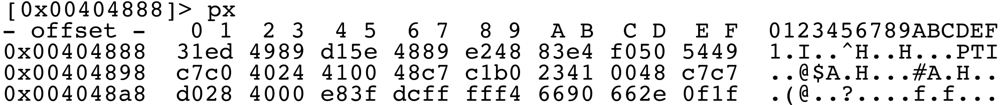
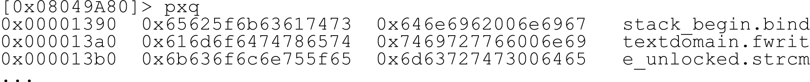

## Print Modes

One of the key features of radare2 is displaying information in many formats. The goal is to offer a selection of display choices to interpret binary data in the best possible way.

Binary data can be represented as integers, shorts, longs, floats, timestamps, hexpair strings, or more complex formats like C structures, disassembly listings, decompilation listing, be a result of an external processing...

Below is a list of available print modes listed by `p?`:

```
[0x00005310]> p?
|Usage: p[=68abcdDfiImrstuxz] [arg|len] [@addr]  
| p[b|B|xb] [len] ([S])   bindump N bits skipping S bytes
| p[iI][df] [len]         print N ops/bytes (f=func) (see pi? and pdi)
| p[kK] [len]             print key in randomart (K is for mosaic)
| p-[?][jh] [mode]        bar|json|histogram blocks (mode: e?search.in)
| p2 [len]                8x8 2bpp-tiles
| p3 [file]               print stereogram (3D)
| p6[de] [len]            base64 decode/encode
| p8[?][j] [len]          8bit hexpair list of bytes
| p=[?][bep] [N] [L] [b]  show entropy/printable chars/chars bars
| pa[edD] [arg]           pa:assemble  pa[dD]:disasm or pae: esil from hex
| pA[n_ops]               show n_ops address and type
| pb[?] [n]               bitstream of N bits
| pB[?] [n]               bitstream of N bytes
| pc[?][p] [len]          output C (or python) format
| pC[aAcdDxw] [rows]      print disassembly in columns (see hex.cols and pdi)
| pd[?] [sz] [a] [b]      disassemble N opcodes (pd) or N bytes (pD)
| pf[?][.nam] [fmt]       print formatted data (pf.name, pf.name $<expr>)
| pF[?][apx]              print asn1, pkcs7 or x509
| pg[?][x y w h] [cmd]    create new visual gadget or print it (see pg? for details)
| ph[?][=|hash] ([len])   calculate hash for a block
| pj[?] [len]             print as indented JSON
| pm[?] [magic]           print libmagic data (see pm? and /m?)
| po[?] hex               print operation applied to block (see po?)
| pp[?][sz] [len]         print patterns, see pp? for more help
| pq[?][is] [len]         print QR code with the first Nbytes
| pr[?][glx] [len]        print N raw bytes (in lines or hexblocks, 'g'unzip)
| ps[?][pwz] [len]        print pascal/wide/zero-terminated strings
| pt[?][dn] [len]         print different timestamps
| pu[?][w] [len]          print N url encoded bytes (w=wide)
| pv[?][jh] [mode]        show variable/pointer/value in memory
| pwd                     display current working directory
| px[?][owq] [len]        hexdump of N bytes (o=octal, w=32bit, q=64bit)
| pz[?] [len]             print zoom view (see pz? for help)
[0x00005310]>
```

Tip: when using json output, you can append the `~{}` to the command to get a pretty-printed version of the output:

```
[0x00000000]> oj
[{"raised":false,"fd":563280,"uri":"malloc://512","from":0,"writable":true,"size":512,"overlaps":false}]
[0x00000000]> oj~{}
[
	{
		"raised": false,
		"fd": 563280,
		"uri": "malloc://512",
		"from": 0,
		"writable": true,
		"size": 512,
		"overlaps": false
	}
]
```

For more on the magical powers of `~` see the help in `?@?`, and the [Command Format](../first_steps/command_format.md) chapter earlier in the book.

### Hexadecimal View

`px` gives a user-friendly output showing 16 pairs of numbers per row with offsets and raw representations:



#### Show Hexadecimal Words Dump (32 bits)


#### 8 bits Hexpair List of Bytes

```
[0x00404888]> p8 16
31ed4989d15e4889e24883e4f0505449
```

#### Show Hexadecimal Quad-words Dump (64 bits)



### Date/Time Formats

Currently supported timestamp output modes are:

```
[0x00404888]> pt?
|Usage: pt [dn]  print timestamps
| pt.  print current time
| pt   print UNIX time (32 bit `cfg.bigendian`) Since January 1, 1970
| ptd  print DOS time (32 bit `cfg.bigendian`) Since January 1, 1980
| pth  print HFS time (32 bit `cfg.bigendian`) Since January 1, 1904
| ptn  print NTFS time (64 bit `cfg.bigendian`) Since January 1, 1601
```

For example, you can 'view' the current buffer as timestamps in the ntfs time:

```
[0x08048000]> e cfg.bigendian = false
[0x08048000]> pt 4
29:04:32948 23:12:36 +0000
[0x08048000]> e cfg.bigendian = true
[0x08048000]> pt 4
20:05:13001 09:29:21 +0000
```

As you can see, the endianness affects the result. Once you have printed a timestamp, you can grep the output, for example, by year:

```
[0x08048000]> pt ~1974 | wc -l
15
[0x08048000]> pt ~2022
27:04:2022 16:15:43 +0000
```

The default date format can be configured using the `cfg.datefmt` variable. Formatting rules for it follow the well known strftime(3) format. Check the manpage for more details, but these are the most important:

```
%a  The abbreviated name of the day of the week according to the current locale.
%A  The full name of the day of the week according to the current locale.
%d  The day of the month as a decimal number (range 01 to 31).
%D  Equivalent to %m/%d/%y.  (Yecch—for Americans only).
%H  The hour as a decimal number using a 24-hour clock (range 00 to 23).
%I  The hour as a decimal number using a 12-hour clock (range 01 to 12).
%m  The month as a decimal number (range 01 to 12).
%M  The minute as a decimal number (range 00 to 59).
%p  Either "AM" or "PM" according to the given time value.
%s  The number of seconds since the Epoch, 1970-01-01 00:00:00  +0000 (UTC). (TZ)
%S  The second as a decimal number (range 00 to 60).  (The range is up to 60 to allow for occasional leap seconds.)
%T  The time in 24-hour notation (%H:%M:%S).  (SU)
%y  The year as a decimal number without a century (range 00 to 99).
%Y  The year as a decimal number including the century.
%z  The +hhmm or -hhmm numeric timezone (that is, the hour and minute offset from UTC). (SU)
%Z  The timezone name or abbreviation.
```

### Basic Types

There are print modes available for all basic types. If you are interested in a more complex structure, type `pf??` for format characters and `pf???` for examples:

```
[0x00499999]> pf??
|pf: pf[.k[.f[=v]]|[v]]|[n]|[0|cnt][fmt] [a0 a1 ...]
| Format:
|  b       byte (unsigned)
|  B       resolve enum bitfield (see t?)
|  c       char (signed byte)
|  C       byte in decimal
|  d       0xHEX value (4 bytes) (see 'i' and 'x')
|  D       disassemble one opcode
|  e       temporally swap endian
|  E       resolve enum name (see t?)
|  f       float value (4 bytes)
|  F       double value (8 bytes)
|  i       signed integer value (4 bytes) (see 'd' and 'x')
|  n       next char specifies size of signed value (1, 2, 4 or 8 byte(s))
|  N       next char specifies size of unsigned value (1, 2, 4 or 8 byte(s))
|  o       octal value (4 byte)
|  p       pointer reference (2, 4 or 8 bytes)
|  q       quadword (8 bytes)
|  r       CPU register `pf r (eax)plop`
|  s       32bit pointer to string (4 bytes)
|  S       64bit pointer to string (8 bytes)
|  t       UNIX timestamp (4 bytes)
|  T       show Ten first bytes of buffer
|  u       uleb128 (variable length)
|  w       word (2 bytes unsigned short in hex)
|  x       0xHEX value and flag (fd @ addr) (see 'd' and 'i')
|  X       show formatted hexpairs
|  z       null terminated string
|  Z       null terminated wide string
|  ?       data structure `pf ? (struct_name)example_name`
|  *       next char is pointer (honors asm.bits)
|  +       toggle show flags for each offset
|  :       skip 4 bytes
|  .       skip 1 byte
|  ;       rewind 4 bytes
|  ,       rewind 1 byte
```

Use triple-question-mark `pf???` to get some examples using print format strings.

```
[0x00499999]> pf???
|pf: pf[.k[.f[=v]]|[v]]|[n]|[0|cnt][fmt] [a0 a1 ...]
| Examples:
| pf 3xi foo bar                               3-array of struct, each with named fields: 'foo' as hex, and 'bar' as int
| pf B (BitFldType)arg_name`                   bitfield type
| pf E (EnumType)arg_name`                     enum type
| pf.obj xxdz prev next size name              Define the obj format as xxdz
| pf obj=xxdz prev next size name              Same as above
| pf *z*i*w nb name blob                       Print the pointers with given labels
| pf iwq foo bar troll                         Print the iwq format with foo, bar, troll as the respective names for the fields
| pf 0iwq foo bar troll                        Same as above, but considered as a union (all fields at offset 0)
| pf.plop ? (troll)mystruct                    Use structure troll previously defined
| pfj.plop @ 0x14                              Apply format object at the given offset
| pf 10xiz pointer length string               Print a size 10 array of the xiz struct with its field names
| pf 5sqw string quad word                     Print an array with sqw struct along with its field names
| pf {integer}? (bifc)                         Print integer times the following format (bifc)
| pf [4]w[7]i                                  Print an array of 4 words and then an array of 7 integers
| pf ic...?i foo bar "(pf xw yo foo)troll" yo  Print nested anonymous structures
| pf ;..x                                      Print value located 6 bytes from current offset
| pf [10]z[3]i[10]Zb                           Print an fixed size str, widechar, and var
| pfj +F @ 0x14                                Print the content at given offset with flag
| pf n2                                        print signed short (2 bytes) value. Use N instead of n for printing unsigned values
| pf [2]? (plop)structname @ 0                 Prints an array of structs
| pf eqew bigWord beef                         Swap endianness and print with given labels
| pf.foo rr (eax)reg1 (eip)reg2                Create object referencing to register values 
| pf tt troll plop                             print time stamps with labels troll and plop
```
Some examples are below:
```
[0x4A13B8C0]> pf i
0x00404888 = 837634441
```
```
[0x4A13B8C0]> pf
0x00404888 = 837634432.000000
```

### High-level Languages Views

Valid print code formats for human-readable languages are:

* `pc`     C
* `pc*`    print 'wx' r2 commands
* `pch`    C half-words (2 byte)
* `pcw`    C words (4 byte)
* `pcd`    C dwords (8 byte)
* `pci`    C array of bytes with instructions
* `pca`    GAS .byte blob
* `pcA`    .bytes with instructions in comments
* `pcs`    string
* `pcS`    shellscript that reconstructs the bin
* `pcj`    json
* `pcJ`    javascript
* `pco`    Objective-C
* `pcp`    python
* `pck`    kotlin
* `pcr`    rust
* `pcv`    JaVa
* `pcV`    V (vlang.io)
* `pcy`    yara
* `pcz`    Swift

If we need to create a .c file containing a binary blob, use the `pc` command, that creates this output. The default size is like in many other commands: the block size, which can be changed with the `b` command.

We can also just temporarily override this block size by expressing it as an argument.

```
[0xB7F8E810]> pc 32
#define _BUFFER_SIZE 32
unsigned char buffer[_BUFFER_SIZE] = {
0x89, 0xe0, 0xe8, 0x49, 0x02, 0x00, 0x00, 0x89, 0xc7, 0xe8, 0xe2, 0xff, 0xff, 0xff, 0x81, 0xc3, 0xd6, 0xa7, 0x01, 0x00, 0x8b, 0x83, 0x00, 0xff, 0xff, 0xff, 0x5a, 0x8d, 0x24, 0x84, 0x29, 0xc2 };
```

That cstring can be used in many programming languages, not just C.

```
[0x7fcd6a891630]> pcs
"\x48\x89\xe7\xe8\x68\x39\x00\x00\x49\x89\xc4\x8b\x05\xef\x16\x22\x00\x5a\x48\x8d\x24\xc4\x29\xc2\x52\x48\x89\xd6\x49\x89\xe5\x48\x83\xe4\xf0\x48\x8b\x3d\x06\x1a
```

### Strings

Strings are probably one of the most important entry points when starting to reverse engineer a program because they usually reference information about functions' actions (asserts, debug or info messages...). Therefore, radare supports various string formats:

```
[0x00000000]> ps?
|Usage: ps[bijqpsuwWxz+] [N]  Print String
| ps       print string
| ps+[j]   print libc++ std::string (same-endian, ascii, zero-terminated)
| psb      print strings in current block
| psi      print string inside curseek
| psj      print string in JSON format
| psp[j]   print pascal string
| psq      alias for pqs
| pss      print string in screen (wrap width)
| psu[zj]  print utf16 unicode (json)
| psw[j]   print 16bit wide string
| psW[j]   print 32bit wide string
| psx      show string with escaped chars
| psz[j]   print zero-terminated string
```

Most strings are zero-terminated. Below there is an example using the debugger to continue the execution of a program until it executes the 'open' syscall. When we recover the control over the process, we get the arguments passed to the syscall, pointed by %ebx. In the case of the 'open' call, it is a zero terminated string which we can inspect using `psz`.

```
[0x4A13B8C0]> dcs open
0x4a14fc24 syscall(5) open ( 0x4a151c91 0x00000000 0x00000000 ) = 0xffffffda
[0x4A13B8C0]> dr
  eax  0xffffffda    esi  0xffffffff    eip    0x4a14fc24
  ebx  0x4a151c91    edi  0x4a151be1    oeax   0x00000005
  ecx  0x00000000    esp  0xbfbedb1c    eflags 0x200246
  edx  0x00000000    ebp  0xbfbedbb0    cPaZstIdor0 (PZI)
[0x4A13B8C0]>
[0x4A13B8C0]> psz @ 0x4a151c91
/etc/ld.so.cache
```

### Print Memory Contents

It is also possible to print various packed data types using the `pf` command:

```
[0xB7F08810]> pf xxS @ rsp
0x7fff0d29da30 = 0x00000001
0x7fff0d29da34 = 0x00000000
0x7fff0d29da38 = 0x7fff0d29da38 -> 0x0d29f7ee /bin/ls
```

This can be used to look at the arguments passed to a function. To achieve this, simply pass a 'format memory string' as an argument to `pf`, and temporally change the current seek position/offset using `@`. It is also possible to define arrays of structures with `pf`. To do this, prefix the format string with a numeric value. You can also define a name for each field of the structure by appending them as a space-separated arguments list.

```
[0x4A13B8C0]> pf 2*xw pointer type @ esp
0x00404888 [0] {
   pointer :
(*0xffffffff8949ed31)      type : 0x00404888 = 0x8949ed31
   0x00404890 = 0x48e2
}
0x00404892 [1] {
(*0x50f0e483)    pointer : 0x00404892 = 0x50f0e483
	 type : 0x0040489a = 0x2440
}
```

A practical example for using `pf` on a binary of a GStreamer plugin:

```
$ radare ~/.gstreamer-0.10/plugins/libgstflumms.so
[0x000028A0]> seek sym.gst_plugin_desc
[0x000185E0]> pf iissxsssss major minor name desc _init version \
 license source package origin
    major : 0x000185e0 = 0
    minor : 0x000185e4 = 10
     name : 0x000185e8 = 0x000185e8 flumms
     desc : 0x000185ec = 0x000185ec Fluendo MMS source
    _init : 0x000185f0 = 0x00002940
  version : 0x000185f4 = 0x000185f4 0.10.15.1
  license : 0x000185f8 = 0x000185f8 unknown
   source : 0x000185fc = 0x000185fc gst-fluendo-mms
  package : 0x00018600 = 0x00018600 Fluendo MMS source
   origin : 0x00018604 = 0x00018604 http://www.fluendo.com
```

### Disassembly

The `pd` command is used to disassemble code. It accepts a numeric value to specify how many instructions should be disassembled. The `pD` command is similar but instead of a number of instructions, it decompiles a given number of bytes.

* `d` : disassembly N opcodes   count of opcodes
* `D` : asm.arch disassembler   bsize bytes

```
[0x00404888]> pd 1
			;-- entry0:
			0x00404888    31ed         xor ebp, ebp
```

### Selecting Target Architecture

The architecture flavor for the disassembler is defined by the `asm.arch` eval variable. You can use `e asm.arch=??` to list all available architectures.

```
[0x00005310]> e asm.arch=??
_dAe  _8_16      6502        LGPL3   6502/NES/C64/Tamagotchi/T-1000 CPU
_dAe  _8         8051        PD      8051 Intel CPU
_dA_  _16_32     arc         GPL3    Argonaut RISC Core
a___  _16_32_64  arm.as      LGPL3   as ARM Assembler (use ARM_AS environment)
adAe  _16_32_64  arm         BSD     Capstone ARM disassembler
_dA_  _16_32_64  arm.gnu     GPL3    Acorn RISC Machine CPU
_d__  _16_32     arm.winedbg LGPL2   WineDBG's ARM disassembler
adAe  _8_16      avr         GPL     AVR Atmel
adAe  _16_32_64  bf          LGPL3   Brainfuck
_dA_  _32        chip8       LGPL3   Chip8 disassembler
_dA_  _16        cr16        LGPL3   cr16 disassembly plugin
_dA_  _32        cris        GPL3    Axis Communications 32-bit embedded processor
adA_  _32_64     dalvik      LGPL3   AndroidVM Dalvik
ad__  _16        dcpu16      PD      Mojang's DCPU-16
_dA_  _32_64     ebc         LGPL3   EFI Bytecode
adAe  _16        gb          LGPL3   GameBoy(TM) (z80-like)
_dAe  _16        h8300       LGPL3   H8/300 disassembly plugin
_dAe  _32        hexagon     LGPL3   Qualcomm Hexagon (QDSP6) V6
_d__  _32        hppa        GPL3    HP PA-RISC
_dAe  _0         i4004       LGPL3   Intel 4004 microprocessor
_dA_  _8         i8080       BSD     Intel 8080 CPU
adA_  _32        java        Apache  Java bytecode
_d__  _32        lanai       GPL3    LANAI
...
```

### Configuring the Disassembler

There are multiple options which can be used to configure the output of the disassembler. All these options are described in `e? asm.`

```
[0x00005310]> e? asm.
asm.anal: Analyze code and refs while disassembling (see anal.strings)
asm.arch: Set the arch to be used by asm
asm.assembler: Set the plugin name to use when assembling
asm.bbline: Show empty line after every basic block
asm.bits: Word size in bits at assembler
asm.bytes: Display the bytes of each instruction
asm.bytespace: Separate hexadecimal bytes with a whitespace
asm.calls: Show callee function related info as comments in disasm
asm.capitalize: Use camelcase at disassembly
asm.cmt.col: Column to align comments
asm.cmt.flgrefs: Show comment flags associated to branch reference
asm.cmt.fold: Fold comments, toggle with Vz
...
```

Currently there are 136 `asm.` configuration variables so we do not list them all.

### Disassembly Syntax

The `asm.syntax` variable is used to change the flavor of the assembly syntax used by a disassembler engine. To switch between Intel and AT&T representations:

```
e asm.syntax = intel
e asm.syntax = att
```

You can also check `asm.pseudo`, which is an experimental pseudocode view,
and `asm.esil` which outputs [ESIL](../disassembling/esil.md) ('Evaluable Strings Intermediate Language'). ESIL's goal is to have a human-readable representation of every opcode semantics. Such representations can be evaluated (interpreted) to emulate effects of individual instructions.
