.vmloop
-------

```
[offset]> fcn.vmloop
```


Well, that seems disappointingly short, but no worries, we have plenty to
reverse yet. The thing is that this function uses a jump table at 0x00400a74,


and r2 can't yet recognize jump tables
([Issue 3201](https://github.com/radareorg/radare2/issues/3201)), so the analysis of
this function is a bit incomplete. This means that we can't really use the graph
view now, so either we just use visual mode, or fix those basic blocks. The
entire function is just 542 bytes long, so we certainly could reverse it without
the aid of the graph mode, but since this writeup aims to include as much r2
wisdom as possible, I'm going to show you how to define basic blocks.

First, lets analyze what we already have! First, *rdi* is put into local_3.
Since the application is a 64bit Linux executable, we know that *rdi* is the
first function argument (as you may have recognized, the automatic analysis of
arguments and local variables was not entirely correct), and we also know that
*vmloop*'s first argument is the bytecode. So lets rename local_3:

```
:> afvn local_3 bytecode
```

Next, *sym.memory* is put into another local variable at *rbp-8* that r2 did not
recognize. So let's define it!

```
:> afv 8 memory qword
```

> ***r2 tip***: The *afv [idx] [name] [type]* command is used to define local
> variable at [frame pointer - idx] with the name [name] and type [type]. You
> can also remove local variables using the *afv- [idx]* command.

In the next block, the program checks one byte of bytecode, and if it is 0, the
function returns with 1.


If that byte is not zero, the program subtracts 0x41 from it, and compares the
result to 0x17. If it is above 0x17, we get the dreaded "Wrong!" message, and
the function returns with 0. This basically means that valid bytecodes are ASCII
characters in the range of "A" (0x41) through "X" (0x41 + 0x17). If the bytecode
is valid, we arrive at the code piece that uses the jump table:


The jump table's base is at 0x400ec0, so lets define that memory area as a
series of qwords:

```
[0x00400a74]> s 0x00400ec0
[0x00400ec0]> Cd 8 @@=`?s $$ $$+8*0x17 8`
```

> ***r2 tip***: Except for the *?s*, all parts of this command should be
> familiar now, but lets recap it! *Cd* defines a memory area as data, and 8 is
> the size of that memory area. *@@* is an iterator that make the preceding
> command run for every element that *@@* holds. In this example it holds a
> series generated using the *?s* command. *?s* simply generates a series from
> the current seek (*$$*) to current seek + 8*0x17 (*$$+8*0x17*) with a step
> of 8.

This is how the disassembly looks like after we add this metadata:

```
[0x00400ec0]> pd 0x18
            ; DATA XREF from 0x00400a76 (unk)
            0x00400ec0 .qword 0x0000000000400a80
            0x00400ec8 .qword 0x0000000000400c04
            0x00400ed0 .qword 0x0000000000400b6d
            0x00400ed8 .qword 0x0000000000400b17
            0x00400ee0 .qword 0x0000000000400c04
            0x00400ee8 .qword 0x0000000000400c04
            0x00400ef0 .qword 0x0000000000400c04
            0x00400ef8 .qword 0x0000000000400c04
            0x00400f00 .qword 0x0000000000400aec
            0x00400f08 .qword 0x0000000000400bc1
            0x00400f10 .qword 0x0000000000400c04
            0x00400f18 .qword 0x0000000000400c04
            0x00400f20 .qword 0x0000000000400c04
            0x00400f28 .qword 0x0000000000400c04
            0x00400f30 .qword 0x0000000000400c04
            0x00400f38 .qword 0x0000000000400b42
            0x00400f40 .qword 0x0000000000400c04
            0x00400f48 .qword 0x0000000000400be5
            0x00400f50 .qword 0x0000000000400ab6
            0x00400f58 .qword 0x0000000000400c04
            0x00400f60 .qword 0x0000000000400c04
            0x00400f68 .qword 0x0000000000400c04
            0x00400f70 .qword 0x0000000000400c04
            0x00400f78 .qword 0x0000000000400b99
```

As we can see, the address 0x400c04 is used a lot, and besides that there are 9
different addresses. Lets see that 0x400c04 first!

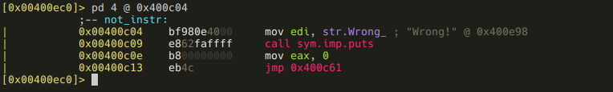

We get the message "Wrong!", and the function just returns 0. This means that
those are not valid instructions (they are valid bytecode though, they can be
e.g. parameters!) We should flag 0x400c04 accordingly:

```
[0x00400ec0]> f not_instr @ 0x0000000000400c04
```

As for the other offsets, they all seem to be doing something meaningful, so we
can assume they belong to valid instructions. I'm going to flag them using the
instructions' ASCII values:

```
[0x00400ec0]> f instr_A @ 0x0000000000400a80
[0x00400ec0]> f instr_C @ 0x0000000000400b6d
[0x00400ec0]> f instr_D @ 0x0000000000400b17
[0x00400ec0]> f instr_I @ 0x0000000000400aec
[0x00400ec0]> f instr_J @ 0x0000000000400bc1
[0x00400ec0]> f instr_P @ 0x0000000000400b42
[0x00400ec0]> f instr_R @ 0x0000000000400be5
[0x00400ec0]> f instr_S @ 0x0000000000400ab6
[0x00400ec0]> f instr_X @ 0x0000000000400b99
```

Ok, so these offsets were not on the graph, so it is time to define basic blocks
for them!

> ***r2 tip***: You can define basic blocks using the *afb+* command. You have
> to supply what function the block belongs to, where does it start, and what is
> its size. If the block ends in a jump, you have to specify where does it jump
> too. If the jump is a conditional jump, the false branch's destination address
> should be specified too.

We can get the start and end addresses of these basic blocks from the full disasm
of *vmloop*.


As I've mentioned previously, the function itself is pretty short, and easy to
read, especially with our annotations. But a promise is a promise, so here is
how we can create the missing bacic blocks for the instructions:

```
[0x00400ec0]> afb+ 0x00400a45 0x00400a80 0x00400ab6-0x00400a80 0x400c15
[0x00400ec0]> afb+ 0x00400a45 0x00400ab6 0x00400aec-0x00400ab6 0x400c15
[0x00400ec0]> afb+ 0x00400a45 0x00400aec 0x00400b17-0x00400aec 0x400c15
[0x00400ec0]> afb+ 0x00400a45 0x00400b17 0x00400b42-0x00400b17 0x400c15
[0x00400ec0]> afb+ 0x00400a45 0x00400b42 0x00400b6d-0x00400b42 0x400c15
[0x00400ec0]> afb+ 0x00400a45 0x00400b6d 0x00400b99-0x00400b6d 0x400c15
[0x00400ec0]> afb+ 0x00400a45 0x00400b99 0x00400bc1-0x00400b99 0x400c15
[0x00400ec0]> afb+ 0x00400a45 0x00400bc1 0x00400be5-0x00400bc1 0x400c15
[0x00400ec0]> afb+ 0x00400a45 0x00400be5 0x00400c04-0x00400be5 0x400c15
```

It is also apparent from the disassembly that besides the instructions there
are three more basic blocks. Lets create them too!

```
[0x00400ec0]> afb+ 0x00400a45 0x00400c15 0x00400c2d-0x00400c15 0x400c3c 0x00400c2d
[0x00400ec0]> afb+ 0x00400a45 0x00400c2d 0x00400c3c-0x00400c2d 0x400c4d 0x00400c3c
[0x00400ec0]> afb+ 0x00400a45 0x00400c3c 0x00400c4d-0x00400c3c 0x400c61
```

Note that the basic blocks starting at 0x00400c15 and 0x00400c2d ending in a
conditional jump, so we had to set the false branch's destination too!

And here is the graph in its full glory after a bit of manual restructuring:


I think it worth it, don't you? :) (Well, the restructuring did not really worth
it, because it is apparently not stored when you save the project.)

> ***r2 tip***: You can move the selected node around in graph view using the
> HJKL keys.

By the way, here is how IDA's graph of this same function looks like for comparison:

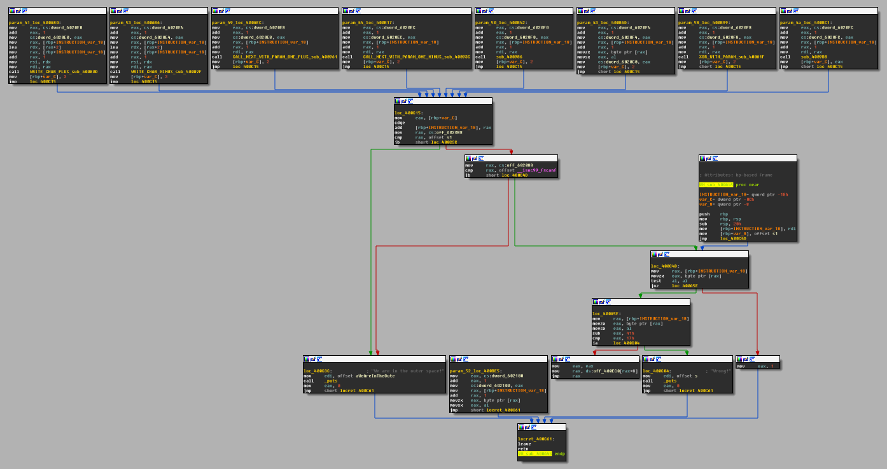

As we browse through the disassembly of the *instr_LETTER* basic blocks, we
should realize a few things. The first: all of the instructions starts with a
sequence like these:

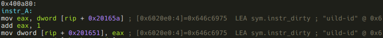

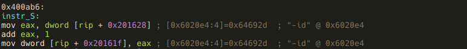

It became clear now that the 9 dwords at *sym.instr_dirty* are not simply
indicators that an instruction got executed, but they are used to count how many
times an instruction got called. Also I should have realized earlier that
*sym.good_if_le_9* (0x6020f0) is part of this 9 dword array, but yeah, well, I
didn't, I have to live with it... Anyways, what the condition
"*sym.good_if_le_9* have to be lesser or equal 9" really means is that *instr_P*
can not be executed more than 9 times:


Another similarity of the instructions is that 7 of them calls a function with
either one or two parameters, where the parameters are the next, or the next two
bytecodes. One parameter example:


And a two parameters example:


We should also realize that these blocks put the number of bytes they eat up of
the bytecode (1 byte instruction + 1 or 2 bytes arguments = 2 or 3) into a local
variable at 0xc. r2 did not recognize this local var, so lets do it manually!

```
:> afv 0xc instr_ptr_step dword
```

If we look at *instr_J* we can see that this is an exception to the above rule,
since it puts the return value of the called function into *instr_ptr_step*
instead of a constant 2 or 3:


And speaking of exceptions, here are the two instructions that do not call functions:


This one simply puts the next bytecode (the first the argument) into *eax*, and
jumps to the end of *vmloop*. So this is the VM's *ret* instruction, and we know
that *vmloop* has to return "\*", so "R\*" should be the last two bytes of our
bytecode.

The next one that does not call a function:

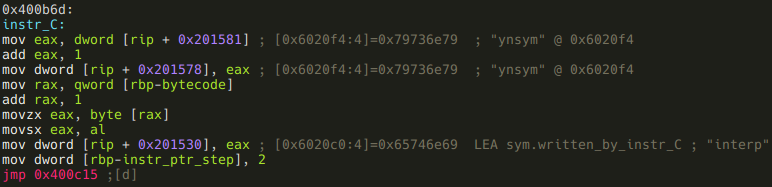

This is a one argument instruction, and it puts its argument to 0x6020c0. Flag
that address!

```
:> f sym.written_by_instr_C 4 @ 0x6020c0
```

Oh, and by the way, I do have a hunch that *instr_C* also had a function call in
the original code, but it got inlined by the compiler. Anyways, so far we have
these two instructions:

- *instr_R(a1):* returns with *a1*
- *instr_C(a1):* writes *a1* to *sym.written_by_instr_C*

And we also know that these accept one argument,

- instr_I
- instr_D
- instr_P
- instr_X
- instr_J

and these accept two:

- instr_A
- instr_S

What remains is the reversing of the seven functions that are called by the
instructions, and finally the construction of a valid bytecode that gives us the
flag.

###instr_A

The function this instruction calls is at offset 0x40080d, so lets seek there!

```
[offset]> 0x40080d
```

> ***r2 tip:*** In visual mode you can just hit \<Enter\> when the current line is
> a jump or a call, and r2 will seek to the destination address.

If we seek to that address from the graph mode, we are presented with a message
that says "Not in a function. Type 'df' to define it here. This is because the
function is called from a basic block r2 did not recognize, so r2 could not
find the function either. Lets obey, and type *df*! A function is indeed created, but
we want some meaningful name for it. So press *dr* while still in visual mode,
and name this function *instr_A*!


> ***r2 tip:*** You should realize that these commands are all part of the same
> menu system in visual mode I was talking about when we first used *Cd* to
> declare *sym.memory* as data.

Ok, now we have our shiny new *fcn.instr_A*, lets reverse it! We can see from
the shape of the minimap that probably there is some kind cascading
if-then-elif, or a switch-case statement involved in this function. This is one
of the reasons the minimap is so useful: you can recognize some patterns at a
glance, which can help you in your analysis (remember the easily recognizable
for loop from a few paragraphs before?) So, the minimap is cool and useful, but
I've just realized that I did not yet show you the full graph mode, so I'm
going to do this using full graph. The first basic blocks:

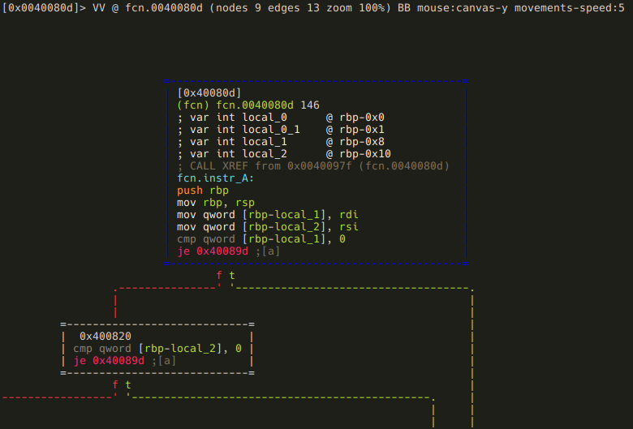

The two function arguments (*rdi* and *rsi*) are stored in local variables, and
the first is compared to 0. If it is, the function returns (you can see it on
the minimap), otherwise the same check is executed on the second argument. The
function returns from here too, if the argument is zero. Although this function
is really tiny, I am going to stick with my methodology, and rename the local
vars:

```
:> afvn local_1 arg1
:> afvn local_2 arg2
```

And we have arrived to the predicted switch-case statement, and we can see that
*arg1*'s value is checked against "M", "P", and "C".

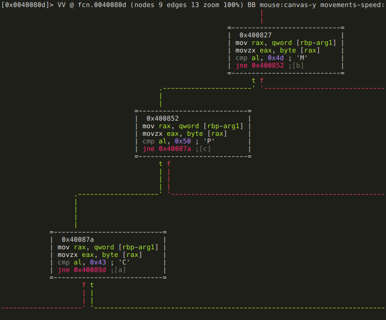

This is the "M" branch:


It basically loads an address from offset 0x602088 and adds *arg2* to the byte
at that address. As r2 kindly shows us in a comment, 0x602088 initially holds
the address of *sym.memory*, the area where we have to construct the "Such VM!
MuCH reV3rse!" string. It is safe to assume that somehow we will be able to
modify the value stored at 0x602088, so this "M" branch will be able to modify
bytes other than the first. Based on this assumption, I'll flag 0x602088 as
*sym.current_memory_ptr*:

```
:> f sym.current_memory_ptr 8 @ 0x602088
```

Moving on to the "P" branch:


Yes, this is the piece of code that allows us to modify
*sym.current_memory_ptr*: it adds *arg2* to it.

Finally, the "C" branch:

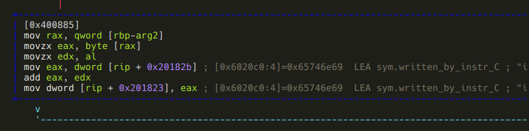

Well, it turned out that *instr_C* is not the only instruction that modifies 
*sym.written_by_instr_C*: this piece of code adds *arg2* to it.

And that was *instr_A*, lets summarize it! Depending on the first argument, this
instruction does the following:

- *arg1* == "M": adds *arg2* to the byte at *sym.current_memory_ptr*.
- *arg1* == "P": steps *sym.current_memory_ptr* by *arg2* bytes.
- *arg1* == "C": adds *arg2* to the value at *sym.written_by_instr_C*.

###instr_S

This function is not recognized either, so we have to manually define it like we
did with *instr_A*. After we do, and take a look at the minimap, scroll through
the basic blocks, it is pretty obvious that these two functions are very-very
similar. We can use *radiff2* to see the difference.

> ***r2 tip:*** radiff2 is used to compare binary files. There's a few options
> we can control the type of binary diffing the tool does, and to what kind of
> output format we want. One of the cool features is that it can generate
> [DarumGrim](http://www.darungrim.org/)-style bindiff graphs using the *-g*
> option.

Since now we want to diff two functions from the same binary, we specify the
offsets with *-g*, and use reverse4 for both binaries. Also, we create the
graphs for comparing *instr_A* to *instr_S* and for comparing *instr_S* to
*instr_A*.

```
[0x00 ~]$ radiff2 -g 0x40080d,0x40089f  reverse4 reverse4 | xdot -
```
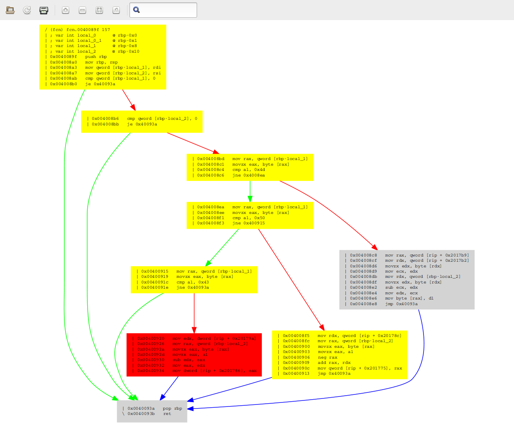

```
[0x00 ~]$ radiff2 -g 0x40089f,0x40080d  reverse4 reverse4 | xdot -
```


A sad truth reveals itself after a quick glance at these graphs: radiff2 is a
liar! In theory, grey boxes should be identical, yellow ones should differ only
at some offsets, and red ones should differ seriously. Well this is obviously
not the case here - e.g. the larger grey boxes are clearly not identical. This
is something I'm definitely going to take a deeper look at after I've finished
this writeup.

Anyways, after we get over the shock of being lied to, we can easily recognize
that *instr_S* is basically a reverse-*instr_A*: where the latter does addition,
the former does subtraction. To summarize this:

- *arg1* == "M": subtracts *arg2* from the byte at *sym.current_memory_ptr*.
- *arg1* == "P": steps *sym.current_memory_ptr* backwards by *arg2* bytes.
- *arg1* == "C": subtracts *arg2* from the value at *sym.written_by_instr_C*.

###instr_I


This one is simple, it just calls *instr_A(arg1, 1)*. As you may have noticed
the function call looks like `call fcn.0040080d` instead of `call fcn.instr_A`.
This is because when you save and open a project, function names get lost -
another thing to examine and patch in r2!

###instr_D


Again, simple: it calls *instr_S(arg1, 1)*.

###instr_P

It's local var rename time again!

```
:> afvn local_0_1 const_M
:> afvn local_0_2 const_P
:> afvn local_3 arg1
```


This function is pretty straightforward also, but there is one oddity: const_M
is never used. I don't know why it is there - maybe it is supposed to be some
kind of distraction? Anyways, this function simply writes *arg1* to
*sym.current_memory_ptr*, and than calls *instr_I("P")*. This basically means
that *instr_P* is used to write one byte, and put the pointer to the next byte.
So far this would seem the ideal instruction to construct most of the "Such VM!
MuCH reV3rse!" string, but remember, this is also the one that can be used only
9 times!

###instr_X

Another simple one, rename local vars anyways!

```
:> afvn local_1 arg1
```


This function XORs the value at *sym.current_memory_ptr* with *arg1*.

###instr_J

This one is not as simple as the previous ones, but it's not that complicated
either. Since I'm obviously obsessed with variable renaming:

```
:> afvn local_3 arg1
:> afvn local_0_4 arg1_and_0x3f
```


After the result of *arg1 & 0x3f* is put into a local variable, *arg1 & 0x40* is
checked against 0. If it isn't zero, *arg1_and_0x3f* is negated:


The next branching: if *arg1* >= 0, then the function returns *arg1_and_0x3f*,


else the function branches again, based on the value of
*sym.written_by_instr_C*:

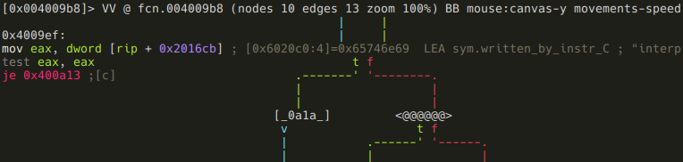

If it is zero, the function returns 2,


else it is checked if *arg1_and_0x3f* is a negative number,

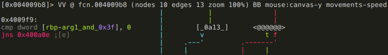

and if it is, *sym.good_if_ne_zero* is incremented by 1:

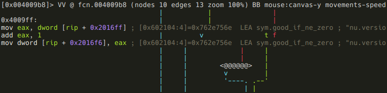

After all this, the function returns with *arg1_and_0x3f*:


