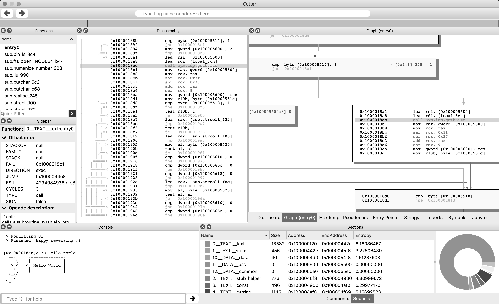

# Интерфейсы пользователя

Для Radare2 на протяжении многих лет разработано много различных пользовательских интерфейсов.

Идея графического интерфейса далеко от использованной идеологии основного механизма инструментария обратного проектирования: предпочтительно иметь отдельный проект и сообщество, позволяющее обоим проектам сотрудничать и совершенствоваться вместе, вместо того, чтобы заставлять разработчиков интерфейса командной строки думать о проблемах графического интерфейса и прыгать взад и вперед между графическим аспектом и низкоуровневой логикой реализаций.

В прошлом было, по крайней мере, пять различных пользовательских интерфейсов (ragui, r2gui, gradare, r2net, bokken), но ни один из них не получил достаточной поддержки, чтобы набрать достаточную популярность, в результате и все они "сложили ласты".

Программа r2 снабжена встроенным веб-сервером и предоставляет неколько простых пользовательских интерфейсов, реализованных при помощи HTML/JS. Данный режим запускается следующим образом:

```
$ r2 -c=H /bin/ls
```

После трех лет самостоятельноq hfphf,jnrb, Уго Тесо, автор проекта Bokken (python-gtk-итерфейс для r2), выпустил для общественности еще один интерфейс для r2, но на этот раз написанный на c++ и qt, что очень понравилось сообществу.

Разработанный графический интерфейс назван Iaito, однако Уго несколько лениво поддерживал проект, что привело и созданию на основе Iaito нового проекта под именем Cutter (так проголосовало сообщество), возглавил проект пользователь Xarkes. Вот как он выглядит:

* [https://github.com/radareorg/cutter](https://github.com/radareorg/cutter).


