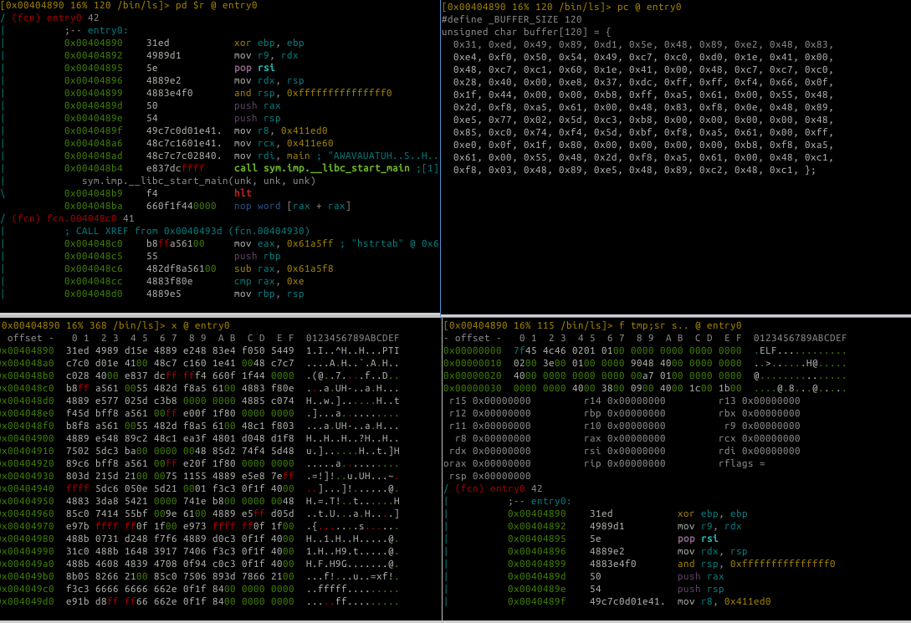

# Visual Mode

The visual mode is a more user-friendly interface alternative to radare2's command-line prompt.  It uses HJKL or arrow keys to move around data and code, has a cursor mode for selecting bytes, and offers numerous key bindings to simplify debugger use.
To enter visual mode, use `V` command. To exit from it back to command line, press `q`.

## Getting Help

To see help on all key bindings defined for visual mode, press `?`:

    Visual mode help:
     ?        show this help or manpage in cursor mode
     &        rotate asm.bits between supported 8, 16, 32, 64
     %        in cursor mode finds matching pair, otherwise toggle autoblocksz
     @        set cmd.vprompt to run commands before the visual prompt
     !        enter into the visual panels mode
     _        enter the hud
     =        set cmd.vprompt (top row)
     |        set cmd.cprompt (right column)
     .        seek to program counter
     /        in cursor mode search in current block
     :cmd     run radare command
     ;[-]cmt  add/remove comment
     /*+-[]   change block size, [] = resize hex.cols
     >||<     seek aligned to block size
     a/A      (a)ssemble code, visual (A)ssembler
     b        toggle breakpoint
     c/C      toggle (c)ursor and (C)olors
     d[f?]    define function, data, code, ..
     D        enter visual diff mode (set diff.from/to)
     e        edit eval configuration variables
     f/F      set/unset or browse flags. f- to unset, F to browse, ..
     gG       go seek to begin and end of file (0-$s)
     hjkl     move around (or HJKL) (left-down-up-right)
     i        insert hex or string (in hexdump) use tab to toggle
     mK/'K    mark/go to Key (any key)
     M        walk the mounted filesystems
     n/N      seek next/prev function/flag/hit (scr.nkey)
     o        go/seek to given offset
     O        toggle asm.esil
     p/P      rotate print modes (hex, disasm, debug, words, buf)
     q        back to radare shell
     r        browse anal info and comments
     R        randomize color palette (ecr)
     sS       step / step over
     T        enter textlog chat console (TT)
     uU       undo/redo seek
     v        visual code analysis menu
     V        (V)iew graph using cmd.graph (agv?)
     wW       seek cursor to next/prev word
     xX       show xrefs/refs of current function from/to data/code
     yY       copy and paste selection
     z        toggle zoom mode
     Enter    follow address of jump/call
    Function Keys: (See 'e key.'), defaults to:
      F2      toggle breakpoint
      F7      single step
      F8      step over
      F9      continue

