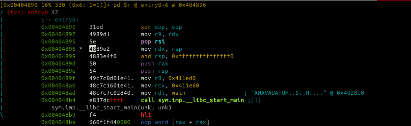
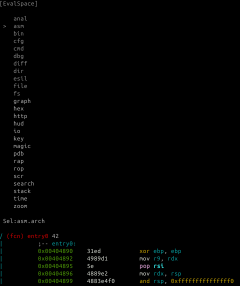
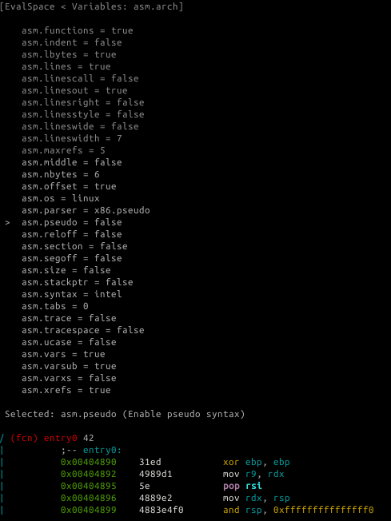

# Visual Disassembly

## Navigation

Move within the Disassembly using `arrows` or `hjkl`. Use `o` to seek directly to a flag or an offset, type it when requested by the prompt: `[offset]>`.
Follow a jump or a call using the `number` of your keyboard `[0-9]` and the number on the right in disassembly to follow a call or a jump. In this example typing `1` on the keyboard would follow the call to `sym.imp.__libc_start_main` and therefore, seek at the offset of this symbol.

```
            0x00404894      e857dcffff     call sym.imp.__libc_start_main ;[1]
```
            
Seek back to the previous location using `u`, `U` will allow you to redo the seek.

## `d` as define

`d` can be used to change the type of data of the current block, several basic types/structures are available as well as more advanced one using `pf` template:

```
d → ...
0x004048f7      48c1e83f       shr rax, 0x3f                                                 
d → b
0x004048f7 .byte 0x48     
d → B
0x004048f7 .word 0xc148                                                                      
d → d
0x004048f7 hex length=165 delta=0                                                            
0x004048f7  48c1 e83f 4801 c648 d1fe 7415 b800 0000  H..?H..H..t.....                                    
...
```

To improve code readability change how radare2 presents numerical values in disassembly, by default most of disassembly display numerical value as hexadecimal. Sometimes you would like to view it as a decimal, binary or even custom defined constant. To change value format you can use `d` following by `i` then choose what base to work in, this is the equivalent to `ahi`:

```
d → i → ...
0x004048f7      48c1e83f       shr rax, 0x3f                                                 
d → i →  10
0x004048f7      48c1e83f       shr rax, 63                                                   
d → i →  2
0x004048f7      48c1e83f       shr rax, '?'
```

### Usage of the Cursor for Inserting/Patching...

Remember that, to be able to actually edit files loaded in radare2, you have to start it with `-w` option. Otherwise a file is opened in read-only mode.

Pressing lowercase `c` toggles the cursor mode. When this mode is active, currently selected byte (or byte range) is highlighted by having a highlighted background.



The cursor is used to select a range of bytes or simply to point to a byte. You can use the latter to create a named flag. Seek to required position, then press `f` and enter a name for a flag.
If you select a range of bytes (with HJKL and SHIFT key pressed), and file write mode has been enabled with `-w` radare2 option, you can press `i` and then enter a byte array to overwrite selected range with new values, used as circular buffer. For example:

    <select 10 bytes in visual mode using SHIFT+HJKL>
    <press 'i' and then enter '12 34'>
    
10 bytes you have selected will be changed to "12 34" repeated in a circular manner: 12 34 12 34 12 34 12 34 12 34.


The Visual Assembler using `A`, this will give you a live-preview of the change you want to do in the disassembly.


##XREF

When radare2 has discovered a XREF during the analysis, it will show you the information in the Visual Disassembly using `XREF` tag:

```
            ; DATA XREF from 0x00402e0e (unk)                        
            str.David_MacKenzie:       
```

To see where this string is called press on `x`, if you want to jump to the location where the data is used then press the corresponding number [0-9] on your keyboard. (This functionality is similar to `axt`)

`X` corresponds to the reverse operation aka `axf`.

## Add a comment

To add a comment just press `;`.

## Type other commands

Quickly type commands using `:`. 

## Search 

`/`: allows highlighting in the current display.
`:cmd` allows you to type r2 command which can give you more search possibility.


## The HUDS

### The "UserFriendly HUD"

Using `??` the "UserFriendly HUD" is displayed. It can be seen as an interactive Cheat sheet that one can complete with its own set of command. This HUD is convenient for new-comers. For experienced user, a HUD per type of activity could also be interesting when dealing with a lot of command within radare2.

### The "flag/comment/functions/.. HUD" 

This HUD can be displayed using `_`, it basically shows a list of all the flags and will allow you to jump to it. Using the keyboard you can quickly filter flag that contain a specific pattern.

## Tweaking the Disassembly

You can change the disassembly look and feel by using the Visual Configuration Editor.

## Visual Configuration Editor

`Ve` or `e` in visual mode allows you to edit radare2 configuration visually.
For example, if you want to change the assembly display just select `asm` in the list and choose your assembly display flavor.





Example switch to pseudo disassembly:




Following are some example of eval variable related to disassembly.

## Examples

#### asm.arch: Change Architecture && asm.bits: Word size in bits at assembler

You can view the list of all arch using `e asm.arch=?`

```
e asm.arch = dalvik
            0x00404870      31ed4989       cmp-long v237, v73, v137                         
            0x00404874      d15e4889       rsub-int v14, v5, 0x8948
            0x00404878      e24883e4       ushr-int/lit8 v72, v131, 0xe4
            0x0040487c      f0505449c7c0   +invoke-object-init-range {}, method+18772 ;[0]
            0x00404882      90244100       add-int v36, v65, v0
```

```
e asm.bits = 16                                   
            0000:4870      31ed           xor bp, bp                                  
            0000:4872      49             dec cx
            0000:4873      89d1           mov cx, dx 
            0000:4875      5e             pop si
            0000:4876      48             dec ax 
            0000:4877      89e2           mov dx, sp
```
This latest operation can also be done using `&` in Visual mode.


#### asm.pseudo: Enable pseudo syntax

```
e asm.pseudo = true                                   
            0x00404870      31ed           ebp = 0                              
            0x00404872      4989d1         r9 = rdx
            0x00404875      5e             pop rsi
            0x00404876      4889e2         rdx = rsp
            0x00404879      4883e4f0       rsp &= 0xfffffffffffffff0
```

#### asm.syntax: Select assembly syntax (intel, att, masm...)

```
e asm.syntax = att
            0x00404870      31ed           xor %ebp, %ebp
            0x00404872      4989d1         mov %rdx, %r9 
            0x00404875      5e             pop %rsi      
            0x00404876      4889e2         mov %rsp, %rdx
            0x00404879      4883e4f0       and $0xfffffffffffffff0, %rsp
```

#### asm.describe: Show opcode description

```
e asm.describe = true
            0x00404870      31ed           xor ebp, ebp                ; logical exclusive or
            0x00404872      4989d1         mov r9, rdx                 ; moves data from src to dst
            0x00404875      5e             pop rsi                     ; pops last element of stack and stores the result in argument
            0x00404876      4889e2         mov rdx, rsp                ; moves data from src to dst        
            0x00404879      4883e4f0       and rsp, 0xfffffffffffffff0 ; binary and operation between src and dst, stores result on dst
```


