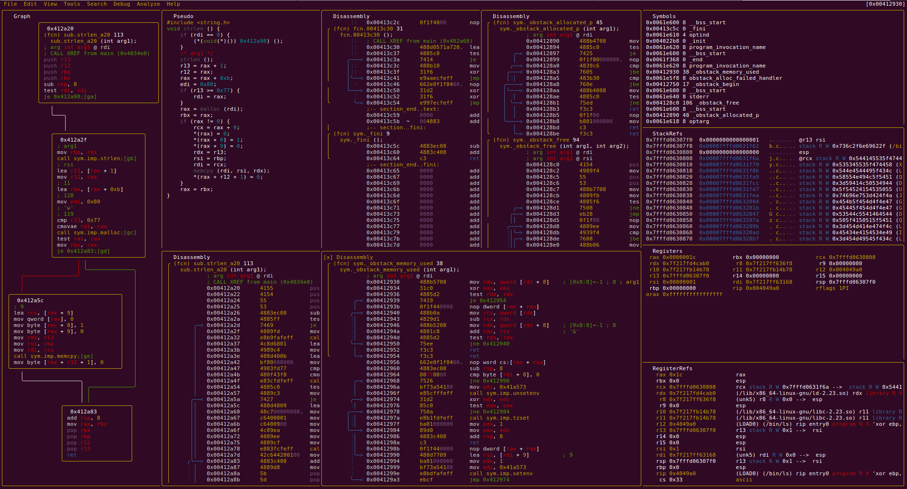

# Visual Panels

## Concept

Visual Panels is characterized by the following core functionalities:

1. Split Screen
2. Display multiple screens such as Symbols, Registers, Stack, as well as custom panels
3. Menu will cover all those commonly used commands for you so that you don't have to memorize any of them

CUI met some useful GUI as the menu, that is Visual Panels.

## Overview



## Commands
```
| Panels commands:
| ?      show this help
| !      run r2048 game
| .      seek to PC or entrypoint
| :      run r2 command in prompt
| _      start the hud input mode
| |      split the current panel vertically
| -      split the current panel horizontally
| *      show pseudo code/r2dec in the current panel
| [1-9]  follow jmp/call identified by shortcut (like ;[1])
| b      browse symbols, flags, configurations, classes, etc
| c      toggle cursor
| C      toggle color
| d      define in the current address. Same as Vd
| D      show disassembly in the current panel
| e      change title and command of current panel
| g      show graph in the current panel
| hjkl   move around (left-down-up-right)
| HL     resize panels horizontally
| JK     scroll panels vertically by page
| i      insert hex
| m      move to the menu
| M      open new custom frame
| nN     create new panel with given command
| r      toggle jmphints/leahints
| o      go/seek to given offset
| pP     seek to next or previous scr.nkey
| q      quit, back to visual mode
| sS     step in / step over
| uU     undo / redo seek
| V      go to the graph mode
| w      change the current layout of the panels
| X      close current panel
```

## Basic Usage

Use `tab` to move around the panels until you get to the targeted panel. Then, use `hjkl`, just like in vim, to scroll the panel you are currently on.
Use `S` and `s` to step over/in, and all the panels should be updated dynamically while you are debugging.
Either in the Registers or Stack panels, you can edit the values by inserting hex. This will be explained later.
While hitting `tab` can help you moving between panels, it is highly recommended to use `m` to open the menu.
As usual, you can use `hjkl` to move around the menu and will find tons of useful stuff there.

## Split Screen

`|` is for the vertical and `-` is for the horizontal split. You can delete any panel by pressing `X`.

## Edit Values

Either in the Register or Stack panel, you can edit the values. Use `c` to activate cursor mode and you can move the cursor by pressing `hjkl`, as usual. Then, hit `i`, just like the insert mode of vim, to insert a value.
